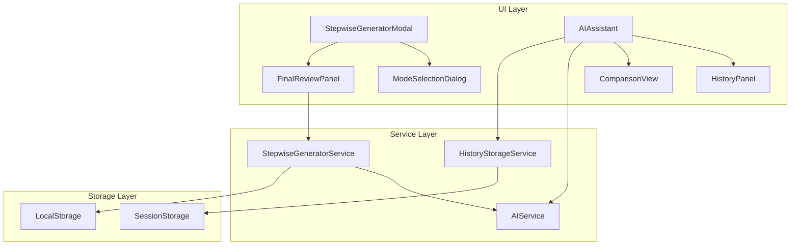
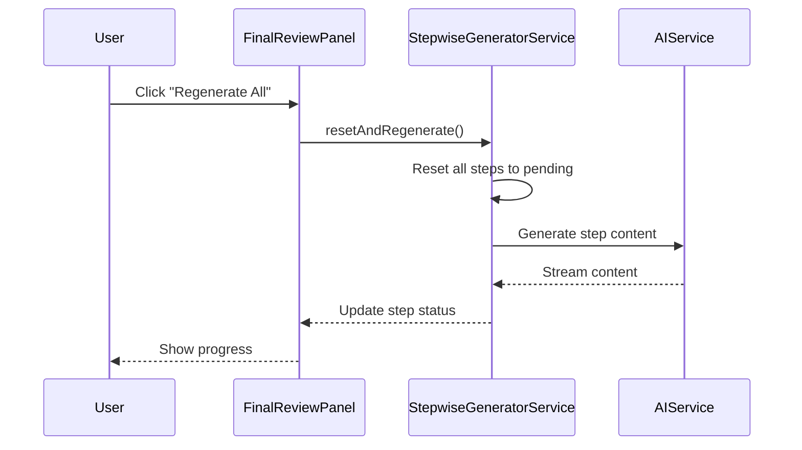

# Design Document: AI Feature Optimization

## Overview

本设计文档描述了 AI 简历编辑器中两个核心 AI 功能的优化方案：
1. **StepwiseGeneratorModal 重新生成功能**：在逐步模式完成后支持重新生成
2. **AIAssistant 用户体验优化**：历史记录、快速操作、对比视图等增强功能

设计遵循现有代码架构，使用 React Context + useState/useCallback 进行状态管理，Framer Motion 实现动画效果，并确保所有用户可见文本使用国际化翻译键。

## Architecture

### 系统架构图



### 数据流图



## Components and Interfaces

### 1. StepwiseGeneratorService 扩展

```typescript
interface RegenerationOptions {
  preserveSelections?: boolean;
  preserveEditedContent?: boolean;
  stepIndices?: number[];
}

interface StepwiseGeneratorService {
  // 新增方法
  resetAndRegenerate(options?: RegenerationOptions): Promise<void>;
  regenerateSelectedSteps(stepIndices: number[]): Promise<void>;
  canRegenerate(): boolean;
  getRegenerationState(): RegenerationState;
  
  // 增强的会话恢复
  hasRecoverableSession(): boolean;
  getRecoverableSessionInfo(): RecoverableSessionInfo | null;
  recoverOrDiscard(recover: boolean): GenerationSession | null;
}

interface RegenerationState {
  isRegenerating: boolean;
  regeneratingStepIndex: number | null;
  retryCount: number;
  lastError: string | null;
}

interface RecoverableSessionInfo {
  sessionId: string;
  savedAt: number;
  completedSteps: number;
  totalSteps: number;
  userInfo: UserGenerationInfo;
}
```

### 2. FinalReviewPanel 增强

```typescript
interface FinalReviewPanelProps {
  session: GenerationSession;
  onToggleSelection: (index: number) => void;
  onSelectAll: () => void;
  onDeselectAll: () => void;
  onApply: () => void;
  onRegenerate: (stepIndex?: number) => void;
  // 新增
  onRegenerateAll: () => void;
  onSwitchMode: () => void;
  regenerationState: RegenerationState;
}
```

### 3. AIAssistant 历史记录服务

```typescript
interface SuggestionHistoryEntry {
  id: string;
  type: AIAssistantType;
  prompt: string;
  suggestions: string[];
  timestamp: number;
  appliedIndex?: number;
}

interface HistoryStorageService {
  addEntry(entry: Omit<SuggestionHistoryEntry, 'id'>): void;
  getHistory(type: AIAssistantType): SuggestionHistoryEntry[];
  clearHistory(type?: AIAssistantType): void;
  markAsApplied(entryId: string, suggestionIndex: number): void;
}

const MAX_HISTORY_ENTRIES = 5;
```

### 4. AIAssistant 快速操作

```typescript
interface QuickAction {
  id: string;
  labelKey: string;
  icon: LucideIcon;
  prompt: string;
  shortcut: string;
}

const QUICK_ACTIONS: Record<AIAssistantType, QuickAction[]> = {
  summary: [
    { id: 'optimize', labelKey: 'ai.quickActions.optimize', icon: Sparkles, prompt: '优化这段内容', shortcut: 'Ctrl+1' },
    { id: 'expand', labelKey: 'ai.quickActions.expand', icon: Expand, prompt: '扩展这段内容', shortcut: 'Ctrl+2' },
    { id: 'condense', labelKey: 'ai.quickActions.condense', icon: Minimize, prompt: '精简这段内容', shortcut: 'Ctrl+3' },
    { id: 'professional', labelKey: 'ai.quickActions.professional', icon: Briefcase, prompt: '使用更专业的语言', shortcut: 'Ctrl+4' }
  ],
  // ... 其他类型
};
```

### 5. 对比视图组件

```typescript
interface ComparisonViewProps {
  original: string;
  suggested: string;
  onApply: () => void;
  onReject: () => void;
}

interface DiffSegment {
  type: 'unchanged' | 'added' | 'removed';
  text: string;
}
```

## Data Models

### 扩展的 GenerationSession

```typescript
interface GenerationSession {
  // 现有字段
  id: string;
  mode: GenerationMode;
  steps: GenerationStep[];
  currentStepIndex: number;
  isPaused: boolean;
  isComplete: boolean;
  userInfo: UserGenerationInfo;
  startedAt: number;
  completedAt: number | null;
  
  // 新增字段
  regenerationHistory: RegenerationRecord[];
  lastSavedAt: number | null;
  autoSaveEnabled: boolean;
}

interface RegenerationRecord {
  stepIndex: number;
  previousContent: string | null;
  regeneratedAt: number;
  reason: 'user_request' | 'error_retry';
}
```

### 历史记录存储结构

```typescript
interface AIAssistantHistory {
  [type: string]: SuggestionHistoryEntry[];
}

// SessionStorage key: 'ai-assistant-history'
```

### 错误重试状态

```typescript
interface RetryState {
  stepIndex: number;
  attemptCount: number;
  lastAttemptAt: number;
  backoffMs: number;
  maxAttempts: number;
}

const RETRY_CONFIG = {
  maxAttempts: 3,
  initialBackoffMs: 1000,
  backoffMultiplier: 2,
  maxBackoffMs: 8000
};
```


## Correctness Properties

*A property is a characteristic or behavior that should hold true across all valid executions of a system—essentially, a formal statement about what the system should do. Properties serve as the bridge between human-readable specifications and machine-verifiable correctness guarantees.*

### Property 1: Regeneration Preserves Invariants

*For any* completed GenerationSession, when resetAndRegenerate() is called:
- All steps should have status 'pending' or 'generating'
- The userInfo should remain unchanged
- Previously selected steps (isSelected) should retain their selection state
- The session should not be marked as complete

**Validates: Requirements 1.2, 1.3, 1.4**

### Property 2: Individual Step Regeneration Isolation

*For any* GenerationSession with multiple completed steps, when regenerateStep(index) is called for a specific step:
- Only the targeted step's status should change to 'generating' then 'completed' or 'error'
- All other steps' status and content should remain unchanged
- The session's currentStepIndex should update appropriately

**Validates: Requirements 1.3, 1.5**

### Property 3: Mode Switch Preserves User Info

*For any* completed GenerationSession, when switching to a different mode:
- The new session's userInfo should be deeply equal to the original session's userInfo
- The new session should have all steps in 'pending' status
- The new session should have a different session ID

**Validates: Requirements 2.2, 2.3**

### Property 4: History Size Limit Invariant

*For any* sequence of suggestion generations for a given content type, the history length should never exceed MAX_HISTORY_ENTRIES (5). When adding a new entry to a full history:
- The oldest entry should be removed
- The new entry should be added at the end
- The total count should remain at MAX_HISTORY_ENTRIES

**Validates: Requirements 3.1, 3.4**

### Property 5: Keyboard Shortcut Mapping Correctness

*For any* quick action with a defined keyboard shortcut, pressing that shortcut combination should:
- Trigger the corresponding action's prompt
- Not trigger any other action
- Work consistently across all content types that support that action

**Validates: Requirements 4.4**

### Property 6: Diff Algorithm Correctness

*For any* two strings (original and suggested), the diff algorithm should produce segments where:
- Concatenating all 'unchanged' and 'added' segments produces the suggested string
- Concatenating all 'unchanged' and 'removed' segments produces the original string
- No segment should be empty

**Validates: Requirements 5.2**

### Property 7: Session Persistence Round-Trip

*For any* GenerationSession that is saved to storage and then recovered:
- The recovered session should be deeply equal to the original session
- All step statuses, content, and selections should be preserved
- The userInfo should be identical

**Validates: Requirements 6.1, 6.3**

### Property 8: Session Expiry Validation

*For any* saved session with a timestamp older than SESSION_EXPIRY_MS (30 minutes):
- hasRecoverableSession() should return false
- recoverSession() should return null
- The expired session should be cleared from storage

**Validates: Requirements 6.4**

### Property 9: Session Cleanup on Completion

*For any* GenerationSession, when cancelGeneration() or applyToResume() is called:
- The stored session in localStorage should be cleared
- hasRecoverableSession() should return false immediately after

**Validates: Requirements 6.5**

### Property 10: Exponential Backoff Calculation

*For any* retry attempt number n (0-indexed), the backoff delay should be:
- delay = min(initialBackoffMs * (backoffMultiplier ^ n), maxBackoffMs)
- For n=0: 1000ms, n=1: 2000ms, n=2: 4000ms

**Validates: Requirements 7.3**

### Property 11: Retry Preserves Completed Steps

*For any* GenerationSession with some completed steps and a failed step, when retrying the failed step:
- All previously completed steps should retain their 'completed' status
- All previously completed steps should retain their content
- Only the failed step's status should change

**Validates: Requirements 7.2**

## Error Handling

### AI Service Errors

| Error Type | Handling Strategy | User Feedback |
|------------|-------------------|---------------|
| Network Error | Exponential backoff retry (3 attempts) | "网络连接失败，正在重试..." |
| API Rate Limit | Wait and retry with longer delay | "请求过于频繁，请稍后重试" |
| Invalid Response | Log error, offer manual retry | "AI 响应异常，请重新生成" |
| Timeout | Abort and offer retry | "请求超时，请检查网络后重试" |
| Auth Error | Prompt user to check config | "AI 配置无效，请检查设置" |

### State Recovery Errors

| Error Type | Handling Strategy | User Feedback |
|------------|-------------------|---------------|
| Corrupted Storage | Clear and start fresh | "会话数据损坏，已重置" |
| Version Mismatch | Migrate or discard | "检测到旧版本数据，已更新" |
| Parse Error | Clear and start fresh | "数据解析失败，已重置" |

### Error State Management

```typescript
interface ErrorState {
  hasError: boolean;
  errorType: 'network' | 'api' | 'storage' | 'unknown';
  errorMessage: string;
  retryable: boolean;
  retryCount: number;
  lastErrorAt: number;
}

// Error recovery flow
const handleError = async (error: Error, context: ErrorContext) => {
  const errorState = classifyError(error);
  
  if (errorState.retryable && errorState.retryCount < MAX_RETRIES) {
    const delay = calculateBackoff(errorState.retryCount);
    await sleep(delay);
    return retry(context);
  }
  
  return showErrorUI(errorState);
};
```

## Testing Strategy

### Unit Tests

Unit tests should cover:
- Component rendering in various states
- Event handler behavior
- Utility function correctness
- Error boundary behavior

### Property-Based Tests

Property-based tests should be implemented using a library like `fast-check` for TypeScript. Each property test should:
- Run minimum 100 iterations
- Use appropriate generators for input data
- Reference the design document property being tested

**Test Configuration:**
```typescript
import fc from 'fast-check';

// Minimum iterations for property tests
const PBT_CONFIG = { numRuns: 100 };
```

**Property Test Tags:**
Each property test should include a comment tag in the format:
```typescript
// Feature: ai-feature-optimization, Property N: [Property Title]
```

### Test Categories

1. **Service Layer Tests**
   - StepwiseGeneratorService state management
   - HistoryStorageService CRUD operations
   - Session persistence and recovery

2. **Component Tests**
   - FinalReviewPanel regeneration UI
   - AIAssistant history panel
   - ComparisonView diff display

3. **Integration Tests**
   - Full regeneration flow
   - Mode switching flow
   - Error recovery flow

### Test Data Generators

```typescript
// Generator for GenerationSession
const sessionArb = fc.record({
  id: fc.string(),
  mode: fc.constantFrom('quick', 'stepByStep'),
  steps: fc.array(stepArb, { minLength: 5, maxLength: 5 }),
  currentStepIndex: fc.integer({ min: 0, max: 4 }),
  isPaused: fc.boolean(),
  isComplete: fc.boolean(),
  userInfo: userInfoArb,
  startedAt: fc.integer({ min: 0 }),
  completedAt: fc.option(fc.integer({ min: 0 }))
});

// Generator for SuggestionHistoryEntry
const historyEntryArb = fc.record({
  id: fc.string(),
  type: fc.constantFrom('summary', 'experience', 'skills', 'education', 'projects'),
  prompt: fc.string(),
  suggestions: fc.array(fc.string(), { minLength: 1, maxLength: 5 }),
  timestamp: fc.integer({ min: 0 }),
  appliedIndex: fc.option(fc.integer({ min: 0, max: 4 }))
});
```
