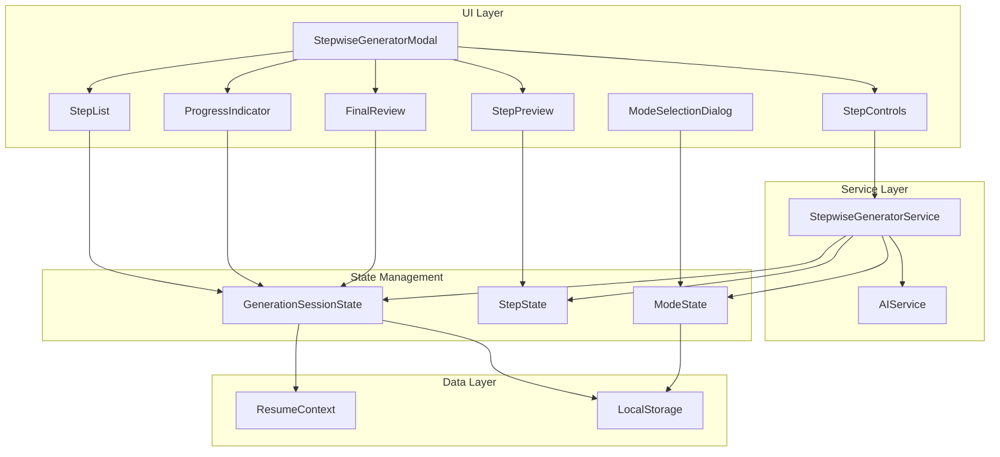
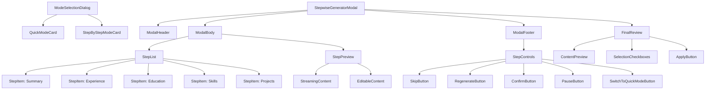

# Design Document: AI Stepwise Generation

## Overview

This design document describes the architecture and implementation of the AI Stepwise Generation feature for the resume editor. The feature transforms the current "one-click generate all" approach into a controlled, step-by-step generation workflow with two selectable modes:

1. **Quick Mode (快速模式)**: All steps run sequentially without pausing, with real-time progress display and final confirmation at the end
2. **Step-by-Step Mode (逐步模式)**: Each step pauses for user confirmation before proceeding, allowing editing and regeneration

The system introduces a `StepwiseGeneratorService` that orchestrates sequential generation of resume modules (summary, experience, education, skills, projects), with real-time streaming output, progress tracking, and user control at each step.

## Architecture



### Component Hierarchy



## Components and Interfaces

### Core Types

```typescript
/**
 * Generation mode types
 */
type GenerationMode = 'quick' | 'stepByStep'

/**
 * Generation step types corresponding to resume modules
 */
type GenerationStepType = 'summary' | 'experience' | 'education' | 'skills' | 'projects'

/**
 * Status of a generation step
 */
type StepStatus = 'pending' | 'generating' | 'completed' | 'error' | 'skipped'

/**
 * Individual step state
 */
interface GenerationStep {
  id: string
  type: GenerationStepType
  status: StepStatus
  content: string | null
  error: string | null
  startedAt: number | null
  completedAt: number | null
  isSelected: boolean // For final review selection
}

/**
 * Complete generation session state
 */
interface GenerationSession {
  id: string
  mode: GenerationMode
  steps: GenerationStep[]
  currentStepIndex: number
  isPaused: boolean
  isComplete: boolean
  userInfo: UserGenerationInfo
  startedAt: number
  completedAt: number | null
}

/**
 * User input for generation context
 */
interface UserGenerationInfo {
  name: string
  targetPosition: string
  industry: string
  experienceLevel: string
}

/**
 * Callbacks for step events
 */
interface StepCallbacks {
  onStepStart: (step: GenerationStep) => void
  onStepProgress: (step: GenerationStep, content: string) => void
  onStepComplete: (step: GenerationStep) => void
  onStepError: (step: GenerationStep, error: string) => void
  onSessionComplete: (session: GenerationSession) => void
  onModeChange: (mode: GenerationMode) => void
}
```

### StepwiseGeneratorService

The core service that orchestrates the generation workflow.

```typescript
class StepwiseGeneratorService {
  private session: GenerationSession | null = null
  private abortController: AbortController | null = null
  
  /**
   * Initialize a new generation session with specified mode
   */
  initSession(userInfo: UserGenerationInfo, mode: GenerationMode): GenerationSession
  
  /**
   * Get saved mode preference from localStorage
   */
  getSavedModePreference(): GenerationMode
  
  /**
   * Save mode preference to localStorage
   */
  saveModePreference(mode: GenerationMode): void
  
  /**
   * Switch from Step-by-Step mode to Quick mode during generation
   */
  switchToQuickMode(): void
  
  /**
   * Start or resume generation from current step
   */
  async startGeneration(callbacks: StepCallbacks): Promise<void>
  
  /**
   * Generate content for a specific step with streaming
   */
  async generateStep(
    step: GenerationStep, 
    onStream: (content: string) => void
  ): Promise<string>
  
  /**
   * Confirm current step and proceed to next (Step-by-Step mode)
   */
  confirmStep(modifiedContent?: string): void
  
  /**
   * Skip current step
   */
  skipStep(): void
  
  /**
   * Regenerate current or specified step
   */
  async regenerateStep(stepIndex?: number): Promise<void>
  
  /**
   * Pause generation workflow
   */
  pauseGeneration(): void
  
  /**
   * Resume generation workflow
   */
  resumeGeneration(): void
  
  /**
   * Cancel generation and cleanup
   */
  cancelGeneration(): void
  
  /**
   * Toggle step selection for final review (Quick mode)
   */
  toggleStepSelection(stepIndex: number): void
  
  /**
   * Apply selected steps to resume data
   */
  applyToResume(): Partial<ResumeData>
  
  /**
   * Get current session state
   */
  getSession(): GenerationSession | null
}
```

### ModeSelectionDialog Component

Dialog for selecting generation mode before starting.

```typescript
interface ModeSelectionDialogProps {
  isOpen: boolean
  defaultMode: GenerationMode
  onSelectMode: (mode: GenerationMode) => void
  onClose: () => void
}

function ModeSelectionDialog({
  isOpen,
  defaultMode,
  onSelectMode,
  onClose
}: ModeSelectionDialogProps): JSX.Element
```

### StepwiseGeneratorModal Component

Main modal component for the stepwise generation UI.

```typescript
interface StepwiseGeneratorModalProps {
  isOpen: boolean
  onClose: () => void
  onComplete: (data: Partial<ResumeData>) => void
  initialUserInfo?: UserGenerationInfo
}

function StepwiseGeneratorModal({
  isOpen,
  onClose,
  onComplete,
  initialUserInfo
}: StepwiseGeneratorModalProps): JSX.Element
```

### FinalReviewPanel Component

Panel for reviewing and selecting content before applying (Quick mode).

```typescript
interface FinalReviewPanelProps {
  session: GenerationSession
  onToggleSelection: (stepIndex: number) => void
  onSelectAll: () => void
  onDeselectAll: () => void
  onApply: () => void
  onRegenerate: (stepIndex: number) => void
}

function FinalReviewPanel({
  session,
  onToggleSelection,
  onSelectAll,
  onDeselectAll,
  onApply,
  onRegenerate
}: FinalReviewPanelProps): JSX.Element
```

### StepList Component

Displays the list of generation steps with their status.

```typescript
interface StepListProps {
  steps: GenerationStep[]
  currentStepIndex: number
  onStepClick: (index: number) => void
}

function StepList({ steps, currentStepIndex, onStepClick }: StepListProps): JSX.Element
```

### StepPreview Component

Shows the generated content with streaming support and editing capability.

```typescript
interface StepPreviewProps {
  step: GenerationStep
  streamingContent: string
  isEditable: boolean
  onContentChange: (content: string) => void
}

function StepPreview({ 
  step, 
  streamingContent, 
  isEditable, 
  onContentChange 
}: StepPreviewProps): JSX.Element
```

### StepControls Component

Control buttons for step actions.

```typescript
interface StepControlsProps {
  step: GenerationStep
  isPaused: boolean
  onConfirm: () => void
  onSkip: () => void
  onRegenerate: () => void
  onPause: () => void
  onResume: () => void
}

function StepControls({
  step,
  isPaused,
  onConfirm,
  onSkip,
  onRegenerate,
  onPause,
  onResume
}: StepControlsProps): JSX.Element
```

## Data Models

### Generation Session Storage

Sessions are stored in memory during active generation and can be persisted to localStorage for recovery.

```typescript
interface StoredSession {
  session: GenerationSession
  timestamp: number
}

// Storage key
const STORAGE_KEY = 'ai-stepwise-session'

// Save session for recovery
function saveSession(session: GenerationSession): void {
  localStorage.setItem(STORAGE_KEY, JSON.stringify({
    session,
    timestamp: Date.now()
  }))
}

// Recover session if exists and not expired (30 min)
function recoverSession(): GenerationSession | null {
  const stored = localStorage.getItem(STORAGE_KEY)
  if (!stored) return null
  
  const { session, timestamp } = JSON.parse(stored) as StoredSession
  const isExpired = Date.now() - timestamp > 30 * 60 * 1000
  
  if (isExpired) {
    localStorage.removeItem(STORAGE_KEY)
    return null
  }
  
  return session
}
```

### Step Configuration

```typescript
const STEP_CONFIG: Record<GenerationStepType, {
  titleKey: string
  descriptionKey: string
  icon: string
  order: number
}> = {
  summary: {
    titleKey: 'stepwise.steps.summary',
    descriptionKey: 'stepwise.steps.summaryDesc',
    icon: 'User',
    order: 1
  },
  experience: {
    titleKey: 'stepwise.steps.experience',
    descriptionKey: 'stepwise.steps.experienceDesc',
    icon: 'Briefcase',
    order: 2
  },
  education: {
    titleKey: 'stepwise.steps.education',
    descriptionKey: 'stepwise.steps.educationDesc',
    icon: 'GraduationCap',
    order: 3
  },
  skills: {
    titleKey: 'stepwise.steps.skills',
    descriptionKey: 'stepwise.steps.skillsDesc',
    icon: 'Wrench',
    order: 4
  },
  projects: {
    titleKey: 'stepwise.steps.projects',
    descriptionKey: 'stepwise.steps.projectsDesc',
    icon: 'FolderOpen',
    order: 5
  }
}
```


## Correctness Properties

*A property is a characteristic or behavior that should hold true across all valid executions of a system—essentially, a formal statement about what the system should do. Properties serve as the bridge between human-readable specifications and machine-verifiable correctness guarantees.*

### Property 1: Mode Selection Persistence

*For any* GenerationMode selected by the user, when saveModePreference is called, subsequent calls to getSavedModePreference SHALL return the same mode until changed.

**Validates: Requirements 1.4**

### Property 2: Session Initialization Creates All Steps

*For any* valid UserGenerationInfo and GenerationMode, when initSession is called, the returned GenerationSession SHALL contain exactly 5 steps (summary, experience, education, skills, projects) in the correct order, all with status 'pending', null content, and isSelected set to true.

**Validates: Requirements 1.1, 2.1**

### Property 3: Step Status Transitions

*For any* GenerationStep, the status SHALL only transition through valid paths:
- pending → generating → completed
- pending → generating → error
- pending → skipped
- completed → generating (regeneration)
- error → generating (retry)
- error → skipped

**Validates: Requirements 2.2, 2.3, 2.4, 2.6, 2.7**

### Property 4: Mode-Specific Behavior

*For any* GenerationSession in Quick Mode, when a step completes, the service SHALL automatically proceed to the next step. *For any* GenerationSession in Step-by-Step Mode, when a step completes, the service SHALL wait for user confirmation before proceeding.

**Validates: Requirements 1.2, 1.3, 2.4, 2.5**

### Property 5: Progress Calculation Accuracy

*For any* GenerationSession with n total steps, where c steps are completed and s steps are skipped, the progress percentage SHALL equal ((c + s) / n) * 100, and the step count SHALL display as "(c + s)/n steps completed".

**Validates: Requirements 3.1**

### Property 6: Session Completion Detection

*For any* GenerationSession, isComplete SHALL be true if and only if all steps have status 'completed' or 'skipped'.

**Validates: Requirements 3.4**

### Property 7: Step Navigation and Regeneration

*For any* GenerationSession with completed steps, navigating to a completed step index SHALL allow viewing that step's content, and calling regenerateStep on that index SHALL reset its status to 'generating' and produce new content.

**Validates: Requirements 4.1, 4.2**

### Property 8: Pause Preserves Completed Data

*For any* GenerationSession, calling pauseGeneration SHALL set isPaused to true without modifying any completed step's content or status. Calling resumeGeneration SHALL set isPaused to false and continue from currentStepIndex.

**Validates: Requirements 4.4, 4.5, 4.6**

### Property 9: Mode Switch Restriction

*For any* GenerationSession, switchToQuickMode SHALL only be callable when the current mode is 'stepByStep'. Calling switchToQuickMode SHALL change the mode to 'quick' and continue generation without pausing.

**Validates: Requirements 1.5**

### Property 10: Content Application Excludes Skipped and Unselected Steps

*For any* GenerationSession, calling applyToResume SHALL return a Partial<ResumeData> containing only the content from steps with status 'completed' AND isSelected set to true. Steps with status 'skipped' or isSelected set to false SHALL NOT be included.

**Validates: Requirements 6.1, 6.2, 6.4, 6.5**

### Property 11: Error Handling Preserves Completed Data

*For any* GenerationSession where a step fails with an error, all previously completed steps SHALL retain their content and status unchanged. The failed step SHALL have status 'error' and a non-null error message.

**Validates: Requirements 7.1, 7.2, 7.3, 7.4**

### Property 12: Translation Keys Completeness

*For any* translation key used in the stepwise generation UI, that key SHALL exist in both the Chinese (zh) and English (en) locale objects with non-empty string values.

**Validates: Requirements 8.1, 8.2**

## Error Handling

### Error Types

```typescript
type StepwiseErrorCode = 
  | 'NETWORK_ERROR'      // Network connectivity issues
  | 'API_ERROR'          // AI service errors
  | 'TIMEOUT_ERROR'      // Generation timeout
  | 'CANCELLED'          // User cancelled generation
  | 'SESSION_EXPIRED'    // Session recovery failed
  | 'UNKNOWN_ERROR'      // Unexpected errors

interface StepwiseError {
  code: StepwiseErrorCode
  message: string
  retryable: boolean
  stepType?: GenerationStepType
}
```

### Error Recovery Strategy

1. **Network Errors**: Mark step as 'error', preserve completed data, show retry button
2. **API Errors**: Display error message, allow retry or skip
3. **Timeout Errors**: Auto-retry once, then mark as error
4. **Cancelled**: Clean up resources, preserve completed steps
5. **Session Expired**: Clear stored session, start fresh

### Error UI States

```typescript
interface ErrorDisplayProps {
  error: StepwiseError
  onRetry: () => void
  onSkip: () => void
  onCancel: () => void
}
```

## Testing Strategy

### Unit Tests

Unit tests focus on specific examples and edge cases:

1. **Service initialization**: Test initSession creates correct initial state
2. **Step transitions**: Test each valid status transition
3. **Edge cases**: Empty user info, single step completion, all steps skipped
4. **Error scenarios**: Network failure, API error, timeout

### Property-Based Tests

Property tests verify universal properties across all inputs using a property-based testing library (e.g., fast-check).

**Configuration**:
- Minimum 100 iterations per property test
- Each test tagged with: **Feature: ai-stepwise-generation, Property {number}: {property_text}**

**Test Implementation**:

1. **Property 1 Test**: Generate arbitrary UserGenerationInfo, verify session structure
2. **Property 2 Test**: Generate arbitrary step sequences, verify valid transitions only
3. **Property 3 Test**: Generate sessions with various completion states, verify progress calculation
4. **Property 4 Test**: Generate sessions with all status combinations, verify isComplete logic
5. **Property 5 Test**: Generate completed sessions, verify navigation and regeneration
6. **Property 6 Test**: Generate sessions, pause at various points, verify data preservation
7. **Property 7 Test**: Generate sessions with mixed completed/skipped steps, verify applyToResume output
8. **Property 8 Test**: Generate sessions with errors at various steps, verify completed data preserved
9. **Property 9 Test**: Extract all translation keys from components, verify existence in both locales

### Integration Tests

1. **Full workflow**: Complete generation from start to finish
2. **Pause/Resume**: Pause mid-generation, resume and complete
3. **Error recovery**: Simulate errors, verify recovery flow
4. **Content application**: Verify generated content correctly updates ResumeContext

### Test File Structure

```
src/
├── services/
│   └── __tests__/
│       ├── stepwiseGenerator.test.ts        # Unit tests
│       └── stepwiseGenerator.property.test.ts # Property tests
├── components/
│   └── ai/
│       └── __tests__/
│           ├── StepwiseGeneratorModal.test.tsx
│           └── stepwiseGenerator.property.test.ts
└── i18n/
    └── __tests__/
        └── stepwiseI18n.property.test.ts    # Translation completeness
```
