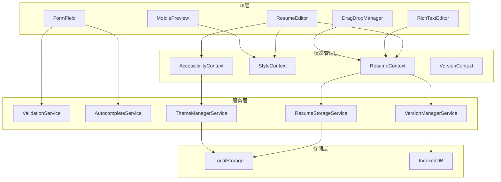
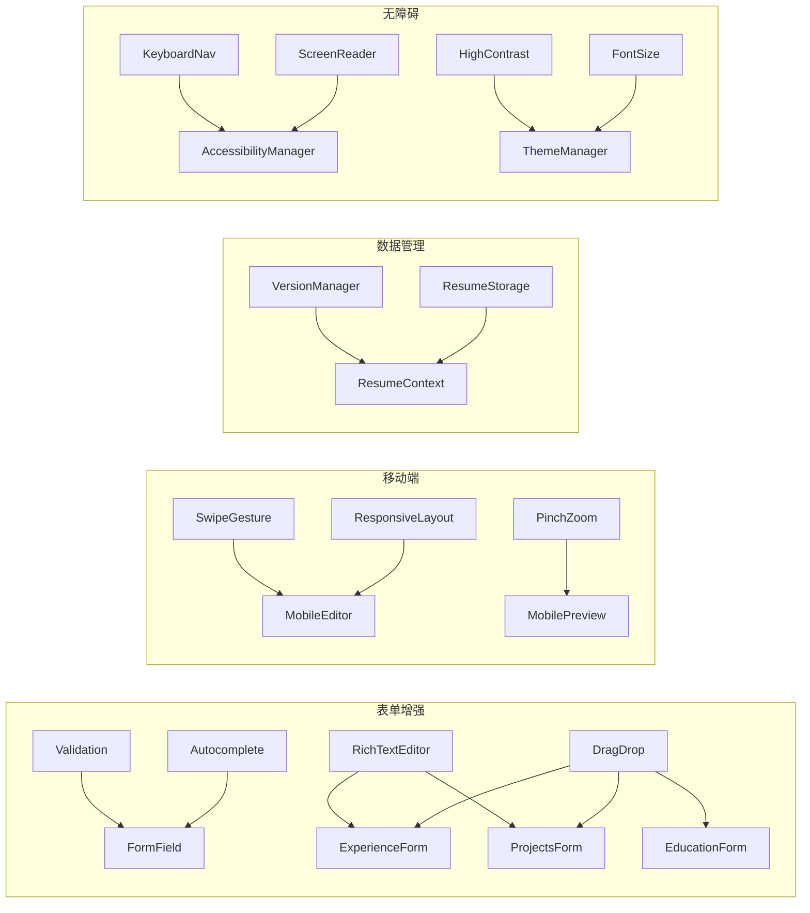

# 设计文档

## 概述

本设计文档描述简历编辑器第三阶段增强功能的技术实现方案。本阶段涵盖四个核心领域：

1. **编辑器表单体验优化** - 实时验证、智能建议、拖拽排序、富文本编辑
2. **移动端体验优化** - 响应式布局、触摸手势、预览体验
3. **数据管理增强** - 版本历史、多简历管理
4. **辅助功能增强** - 键盘无障碍、屏幕阅读器、高对比度、字体调节

所有功能基于 Next.js 14 App Router 架构，使用 React Context 进行状态管理，数据存储于浏览器本地存储。

## 架构

### 系统架构图



### 模块依赖关系



## 组件和接口

### 1. 表单验证组件

#### ValidationService 增强

```typescript
// src/services/validationService.ts

interface ValidationResult {
  isValid: boolean
  message?: string
  fieldName: string
  status: 'valid' | 'invalid' | 'pending' | 'pristine'
}

interface ValidationRule {
  type: 'required' | 'email' | 'phone' | 'url' | 'date' | 'dateRange' | 'custom'
  message?: string
  validator?: (value: string) => boolean
}

interface PhoneFormat {
  country: string
  pattern: RegExp
  example: string
}

// 支持的国际电话格式
const PHONE_FORMATS: PhoneFormat[] = [
  { country: 'CN', pattern: /^1[3-9]\d{9}$/, example: '13812345678' },
  { country: 'HK', pattern: /^[5-9]\d{7}$/, example: '51234567' },
  { country: 'TW', pattern: /^09\d{8}$/, example: '0912345678' },
  { country: 'US', pattern: /^\d{10}$/, example: '2025551234' }
]

class ValidationService {
  validateEmail(email: string): ValidationResult
  validatePhone(phone: string, formats?: PhoneFormat[]): ValidationResult
  validateUrl(url: string): ValidationResult
  validateDateRange(startDate: string, endDate: string): ValidationResult
  validateRequired(value: string, fieldName: string): ValidationResult
  validateWithDebounce(value: string, rules: ValidationRule[], delay?: number): Promise<ValidationResult>
}
```

#### FormField 组件增强

```typescript
// src/components/FormField.tsx

interface FormFieldProps {
  name: string
  label: string
  value: string
  onChange: (value: string) => void
  validation?: ValidationRule[]
  showValidationStatus?: boolean
  debounceMs?: number
  autocomplete?: AutocompleteConfig
  required?: boolean
  disabled?: boolean
  placeholder?: string
  helpText?: string
  'aria-describedby'?: string
}

interface FormFieldState {
  validationResult: ValidationResult
  isTouched: boolean
  isFocused: boolean
}
```

### 2. 自动补全组件

```typescript
// src/services/autocompleteService.ts

interface AutocompleteConfig {
  type: 'company' | 'position' | 'school' | 'major' | 'skill'
  maxSuggestions?: number
  minInputLength?: number
  includeHistory?: boolean
}

interface AutocompleteSuggestion {
  value: string
  label: string
  category?: string
  frequency?: number
}

class AutocompleteService {
  getSuggestions(input: string, config: AutocompleteConfig): AutocompleteSuggestion[]
  addToHistory(type: string, value: string): void
  getHistory(type: string): string[]
  clearHistory(type?: string): void
}

// src/components/AutocompleteInput.tsx

interface AutocompleteInputProps {
  value: string
  onChange: (value: string) => void
  config: AutocompleteConfig
  onSelect?: (suggestion: AutocompleteSuggestion) => void
  renderSuggestion?: (suggestion: AutocompleteSuggestion) => ReactNode
}
```

### 3. 拖拽排序组件

```typescript
// src/hooks/useDragDrop.ts

interface DragDropConfig {
  items: { id: string }[]
  onReorder: (newOrder: string[]) => void
  axis?: 'vertical' | 'horizontal'
  lockAxis?: boolean
  animationDuration?: number
}

interface DragState {
  isDragging: boolean
  draggedId: string | null
  dropTargetId: string | null
  dragOffset: { x: number; y: number }
}

interface DragDropHandlers {
  onDragStart: (id: string, e: React.DragEvent | React.TouchEvent) => void
  onDragOver: (id: string, e: React.DragEvent | React.TouchEvent) => void
  onDragEnd: () => void
  getDragProps: (id: string) => DragItemProps
}

function useDragDrop(config: DragDropConfig): [DragState, DragDropHandlers]
```

### 4. 富文本编辑器组件

```typescript
// src/components/RichTextEditor.tsx

interface RichTextEditorProps {
  value: string
  onChange: (value: string) => void
  placeholder?: string
  minHeight?: number
  maxHeight?: number
  toolbar?: ToolbarConfig
  onFocus?: () => void
  onBlur?: () => void
}

interface ToolbarConfig {
  bold?: boolean
  italic?: boolean
  underline?: boolean
  orderedList?: boolean
  unorderedList?: boolean
  link?: boolean
  clearFormat?: boolean
}

interface EditorState {
  content: string
  selection: { start: number; end: number }
  history: string[]
  historyIndex: number
}
```

### 5. 移动端布局组件

```typescript
// src/components/MobileLayout.tsx

interface MobileLayoutProps {
  children: ReactNode
  activeSection: string
  onSectionChange: (section: string) => void
  showPreview: boolean
  onTogglePreview: () => void
}

interface BreakpointConfig {
  sm: 640
  md: 768
  lg: 1024
  xl: 1280
}

// src/hooks/useResponsiveLayout.ts

interface ResponsiveLayoutState {
  breakpoint: 'sm' | 'md' | 'lg' | 'xl'
  isMobile: boolean
  isTablet: boolean
  isDesktop: boolean
  columns: 1 | 2 | 3
}

function useResponsiveLayout(): ResponsiveLayoutState
```

### 6. 触摸手势增强

```typescript
// src/hooks/usePinchZoom.ts

interface PinchZoomConfig {
  minScale?: number
  maxScale?: number
  initialScale?: number
  onScaleChange?: (scale: number) => void
}

interface PinchZoomState {
  scale: number
  origin: { x: number; y: number }
}

function usePinchZoom(config: PinchZoomConfig): [PinchZoomState, PinchZoomHandlers]

// src/hooks/useLongPress.ts

interface LongPressConfig {
  delay?: number
  onLongPress: (e: React.TouchEvent | React.MouseEvent) => void
  onPress?: () => void
}

function useLongPress(config: LongPressConfig): LongPressHandlers
```

### 7. 版本管理服务

```typescript
// src/services/versionManagerService.ts

interface ResumeVersion {
  id: string
  timestamp: number
  data: ResumeData
  summary: string
  size: number
}

interface VersionDiff {
  field: string
  oldValue: any
  newValue: any
  type: 'added' | 'removed' | 'modified'
}

class VersionManagerService {
  createVersion(data: ResumeData, summary?: string): ResumeVersion
  getVersions(limit?: number): ResumeVersion[]
  getVersion(id: string): ResumeVersion | null
  restoreVersion(id: string): ResumeData
  compareVersions(id1: string, id2: string): VersionDiff[]
  deleteVersion(id: string): void
  cleanupOldVersions(maxVersions?: number): void
  getStorageUsage(): { used: number; total: number }
}
```

### 8. 多简历存储服务

```typescript
// src/services/resumeStorageService.ts

interface StoredResume {
  id: string
  name: string
  data: ResumeData
  createdAt: number
  updatedAt: number
  tags: string[]
  thumbnail?: string
}

interface ResumeListItem {
  id: string
  name: string
  updatedAt: number
  tags: string[]
  thumbnail?: string
}

class ResumeStorageService {
  createResume(name: string, data?: ResumeData): StoredResume
  duplicateResume(id: string, newName: string): StoredResume
  getResume(id: string): StoredResume | null
  getAllResumes(): ResumeListItem[]
  updateResume(id: string, data: Partial<StoredResume>): StoredResume
  deleteResume(id: string): void
  renameResume(id: string, name: string): void
  addTag(id: string, tag: string): void
  removeTag(id: string, tag: string): void
  getResumeCount(): number
  isAtLimit(): boolean
}
```

### 9. 无障碍管理器

```typescript
// src/contexts/AccessibilityContext.tsx

interface AccessibilityState {
  highContrast: boolean
  fontSize: 'small' | 'medium' | 'large' | 'xlarge'
  reducedMotion: boolean
  screenReaderMode: boolean
}

interface AccessibilityContextType {
  state: AccessibilityState
  setHighContrast: (enabled: boolean) => void
  setFontSize: (size: AccessibilityState['fontSize']) => void
  setReducedMotion: (enabled: boolean) => void
  announceToScreenReader: (message: string, priority?: 'polite' | 'assertive') => void
}

// src/hooks/useKeyboardNavigation.ts

interface KeyboardNavigationConfig {
  containerRef: RefObject<HTMLElement>
  itemSelector: string
  orientation?: 'horizontal' | 'vertical' | 'both'
  wrap?: boolean
  onSelect?: (element: HTMLElement) => void
}

function useKeyboardNavigation(config: KeyboardNavigationConfig): void
```

### 10. 主题管理器

```typescript
// src/services/themeManagerService.ts

interface ThemeConfig {
  highContrast: boolean
  fontSize: number
  lineHeight: number
  borderWidth: number
  focusRingWidth: number
}

class ThemeManagerService {
  getTheme(): ThemeConfig
  setHighContrast(enabled: boolean): void
  setFontSize(size: 'small' | 'medium' | 'large' | 'xlarge'): void
  applyTheme(config: Partial<ThemeConfig>): void
  resetToDefaults(): void
  detectSystemPreferences(): Partial<ThemeConfig>
}
```

## 数据模型

### 验证结果模型

```typescript
interface ValidationResult {
  isValid: boolean
  message?: string
  fieldName: string
  status: 'valid' | 'invalid' | 'pending' | 'pristine'
}
```

### 版本历史模型

```typescript
interface ResumeVersion {
  id: string                    // 唯一标识符
  timestamp: number             // 创建时间戳
  data: ResumeData             // 完整简历数据快照
  summary: string              // 修改摘要
  size: number                 // 数据大小（字节）
}

interface VersionHistory {
  versions: ResumeVersion[]
  maxVersions: number          // 最大版本数（默认30）
  currentVersionId: string     // 当前版本ID
}
```

### 多简历存储模型

```typescript
interface StoredResume {
  id: string
  name: string
  data: ResumeData
  createdAt: number
  updatedAt: number
  tags: string[]
  thumbnail?: string           // Base64 缩略图
}

interface ResumeStorage {
  resumes: StoredResume[]
  activeResumeId: string
  maxResumes: number           // 最大简历数（默认10）
}
```

### 无障碍配置模型

```typescript
interface AccessibilityConfig {
  highContrast: boolean
  fontSize: 'small' | 'medium' | 'large' | 'xlarge'
  reducedMotion: boolean
  focusIndicatorStyle: 'outline' | 'ring' | 'both'
}

// 字体大小映射
const FONT_SIZE_MAP = {
  small: { base: 14, heading: 18, label: 12 },
  medium: { base: 16, heading: 20, label: 14 },
  large: { base: 18, heading: 24, label: 16 },
  xlarge: { base: 20, heading: 28, label: 18 }
}
```

### 拖拽状态模型

```typescript
interface DragState {
  isDragging: boolean
  draggedId: string | null
  dropTargetId: string | null
  dragOffset: { x: number; y: number }
  originalIndex: number
  currentIndex: number
}
```

### 富文本内容模型

```typescript
interface RichTextContent {
  type: 'paragraph' | 'list' | 'link'
  content: string | RichTextContent[]
  attributes?: {
    bold?: boolean
    italic?: boolean
    underline?: boolean
    href?: string
    listType?: 'ordered' | 'unordered'
  }
}
```


## 正确性属性

*正确性属性是一种应该在系统所有有效执行中保持为真的特征或行为——本质上是关于系统应该做什么的形式化陈述。属性作为人类可读规范和机器可验证正确性保证之间的桥梁。*

### Property 1: 邮箱验证正确性

*For any* 字符串输入，如果该字符串符合标准邮箱格式（包含 @ 符号、域名和有效的顶级域名），THE Validation_Service SHALL 返回 isValid: true；否则返回 isValid: false 并包含错误消息。

**Validates: Requirements 1.1**

### Property 2: 国际电话号码验证正确性

*For any* 电话号码字符串和支持的国家格式列表，如果该号码符合任一支持格式的正则表达式，THE Validation_Service SHALL 返回 isValid: true；否则返回 isValid: false。

**Validates: Requirements 1.2**

### Property 3: URL 验证正确性

*For any* URL 字符串，如果该字符串是有效的 http 或 https URL（可被 URL 构造函数解析），THE Validation_Service SHALL 返回 isValid: true；否则返回 isValid: false。

**Validates: Requirements 1.3**

### Property 4: 日期范围验证正确性

*For any* 开始日期和结束日期对，如果开始日期晚于结束日期，THE Validation_Service SHALL 返回 isValid: false 并包含错误消息；否则返回 isValid: true。

**Validates: Requirements 1.7**

### Property 5: 验证结果结构完整性

*For any* 验证操作的返回结果，该结果 SHALL 包含 isValid（布尔值）、fieldName（字符串）和 status（枚举值）字段；当 isValid 为 false 时，SHALL 包含 message 字段。

**Validates: Requirements 1.9**

### Property 6: 自动补全建议相关性

*For any* 输入前缀和自动补全类型（公司、职位、学校、专业、技能），THE AutocompleteService SHALL 返回的所有建议都包含该输入前缀（不区分大小写），且建议数量不超过配置的最大值。

**Validates: Requirements 2.1, 2.2, 2.3, 2.4, 2.5**

### Property 7: 自动补全键盘导航正确性

*For any* 自动补全建议列表和当前选中索引，按下向下箭头 SHALL 将索引增加 1（或在末尾时回到 0），按下向上箭头 SHALL 将索引减少 1（或在开头时跳到末尾）。

**Validates: Requirements 2.6**

### Property 8: 自动补全历史优先级

*For any* 自动补全建议列表，用户历史记录中的项目 SHALL 出现在建议列表的前面，按使用频率降序排列。

**Validates: Requirements 2.8**

### Property 9: 拖拽排序正确性

*For any* 列表项数组和拖拽操作（从索引 A 移动到索引 B），拖拽完成后的数组 SHALL 保持所有原始项目（无丢失、无重复），且被拖拽项目位于新索引位置。

**Validates: Requirements 3.4, 3.5, 3.6, 3.7, 3.9**

### Property 10: 富文本格式化正确性

*For any* 纯文本内容和格式化操作（粗体、斜体、下划线、列表），应用格式化后的输出 SHALL 包含正确的 HTML 标签，且原始文本内容保持不变。

**Validates: Requirements 4.1, 4.2, 4.3**

### Property 11: 富文本撤销/重做往返正确性

*For any* 富文本编辑器状态和编辑操作序列，执行撤销操作后再执行重做操作 SHALL 恢复到撤销前的状态。

**Validates: Requirements 4.9**

### Property 12: 响应式布局断点正确性

*For any* 视口宽度值，THE ResponsiveLayout SHALL 返回正确的断点和列数：宽度 < 640px 返回 'sm' 和 1 列，640-768px 返回 'md' 和 1 列，768-1024px 返回 'lg' 和 2 列，> 1024px 返回 'xl' 和 3 列。

**Validates: Requirements 5.1, 5.5, 8.1, 8.2, 8.3, 8.4, 8.5**

### Property 13: 触摸目标尺寸正确性

*For any* 交互元素（按钮、链接、输入框），其计算后的宽度和高度 SHALL 至少为 44 像素。

**Validates: Requirements 5.6**

### Property 14: 滑动手势导航正确性

*For any* 水平滑动手势（距离超过阈值），向左滑动 SHALL 导航到下一个部分，向右滑动 SHALL 导航到上一个部分，且部分索引保持在有效范围内。

**Validates: Requirements 6.1**

### Property 15: 捏合缩放正确性

*For any* 捏合手势和当前缩放比例，缩放后的比例 SHALL 保持在配置的最小值和最大值之间。

**Validates: Requirements 6.2**

### Property 16: 版本创建正确性

*For any* 简历数据修改操作，THE Version_Manager SHALL 创建一个新版本，该版本包含完整的数据快照、时间戳和修改摘要。

**Validates: Requirements 9.1, 9.3**

### Property 17: 版本数量限制正确性

*For any* 版本历史，版本数量 SHALL 不超过配置的最大值（默认 30）；当超过限制时，最旧的版本 SHALL 被删除。

**Validates: Requirements 9.2, 9.8**

### Property 18: 版本恢复往返正确性

*For any* 版本恢复操作，恢复前的当前数据 SHALL 被保存为新版本，恢复后的数据 SHALL 与目标版本的数据完全相等。

**Validates: Requirements 9.5, 9.7**

### Property 19: 版本差异计算正确性

*For any* 两个版本 A 和 B，THE Version_Manager 的 compareVersions 函数 SHALL 返回所有字段差异，每个差异包含字段名、旧值、新值和变更类型。

**Validates: Requirements 9.6**

### Property 20: 简历存储 CRUD 正确性

*For any* 简历存储操作（创建、读取、更新、删除），操作完成后 getAllResumes() 的结果 SHALL 反映该操作的效果：创建后列表增加一项，删除后列表减少一项，更新后对应项的数据已更改。

**Validates: Requirements 10.1, 10.2, 10.3, 10.5, 10.6, 10.7**

### Property 21: 简历数量限制正确性

*For any* 简历存储状态，当简历数量达到最大值（默认 10）时，isAtLimit() SHALL 返回 true，且 createResume() SHALL 抛出错误或返回 null。

**Validates: Requirements 10.8, 10.9**

### Property 22: 键盘导航正确性

*For any* 可聚焦元素列表和方向键按下事件，焦点 SHALL 按照视觉顺序移动到相邻元素，且 Escape 键 SHALL 关闭任何打开的模态框或下拉菜单。

**Validates: Requirements 11.5, 11.6, 11.8**

### Property 23: ARIA 无障碍属性正确性

*For any* 交互元素，该元素 SHALL 具有适当的 ARIA 属性：按钮有 aria-label，表单字段有关联标签，可展开区域有 aria-expanded，当前导航项有 aria-current。

**Validates: Requirements 12.1, 12.2, 12.4, 12.5, 12.6**

### Property 24: 高对比度样式正确性

*For any* 高对比度模式下的文本元素，其前景色和背景色的对比度 SHALL 至少为 7:1，且边框宽度 SHALL 大于正常模式。

**Validates: Requirements 13.2, 13.3, 13.4**

### Property 25: 字体大小缩放正确性

*For any* 字体大小设置（小、中、大、特大），所有文本元素的 font-size SHALL 按照预定义的比例缩放，且 line-height SHALL 相应调整以保持可读性比例。

**Validates: Requirements 14.2, 14.6**

### Property 26: 字体大小持久化往返正确性

*For any* 字体大小设置，保存到本地存储后重新加载 SHALL 恢复相同的字体大小设置。

**Validates: Requirements 14.4**

## 错误处理

### 验证错误处理

```typescript
// 验证错误类型
interface ValidationError {
  fieldName: string
  message: string
  code: 'REQUIRED' | 'FORMAT' | 'RANGE' | 'CUSTOM'
}

// 错误处理策略
const handleValidationError = (error: ValidationError): void => {
  // 1. 更新字段状态为 invalid
  // 2. 显示错误消息
  // 3. 通知屏幕阅读器（aria-live）
  // 4. 记录错误日志（开发模式）
}
```

### 存储错误处理

```typescript
// 存储错误类型
type StorageErrorCode = 
  | 'QUOTA_EXCEEDED'    // 存储空间不足
  | 'PARSE_ERROR'       // 数据解析失败
  | 'VERSION_MISMATCH'  // 版本不兼容
  | 'NOT_FOUND'         // 数据不存在

// 错误恢复策略
const handleStorageError = (code: StorageErrorCode): void => {
  switch (code) {
    case 'QUOTA_EXCEEDED':
      // 清理旧版本，提示用户
      break
    case 'PARSE_ERROR':
      // 尝试恢复，使用默认值
      break
    case 'VERSION_MISMATCH':
      // 数据迁移
      break
    case 'NOT_FOUND':
      // 创建新数据
      break
  }
}
```

### 手势错误处理

```typescript
// 手势识别失败时的回退
const handleGestureError = (gesture: string): void => {
  // 1. 提供替代的按钮操作
  // 2. 显示操作提示
  // 3. 记录手势失败原因
}
```

## 测试策略

### 双重测试方法

本项目采用单元测试和属性测试相结合的方法：

- **单元测试**: 验证特定示例、边界情况和错误条件
- **属性测试**: 验证跨所有输入的通用属性

### 属性测试配置

- 使用 **fast-check** 作为属性测试库
- 每个属性测试最少运行 **100 次迭代**
- 每个测试必须引用设计文档中的属性编号
- 标签格式: **Feature: editor-enhancement-phase3, Property {number}: {property_text}**

### 测试文件结构

```
src/
├── services/__tests__/
│   ├── validationService.property.test.ts    # Properties 1-5
│   ├── autocompleteService.property.test.ts  # Properties 6-8
│   ├── versionManagerService.property.test.ts # Properties 16-19
│   └── resumeStorageService.property.test.ts # Properties 20-21
├── hooks/__tests__/
│   ├── useDragDrop.property.test.ts          # Property 9
│   ├── useResponsiveLayout.property.test.ts  # Property 12
│   ├── usePinchZoom.property.test.ts         # Property 15
│   └── useSwipeGesture.property.test.ts      # Property 14
├── components/__tests__/
│   ├── RichTextEditor.property.test.ts       # Properties 10-11
│   ├── accessibility.property.test.ts        # Properties 22-23
│   └── themeManager.property.test.ts         # Properties 24-26
└── utils/__tests__/
    └── touchTarget.property.test.ts          # Property 13
```

### 单元测试覆盖

单元测试应聚焦于：
- 特定示例和边界情况
- 组件集成点
- 错误条件和异常处理
- UI 渲染验证

### 测试示例

```typescript
// Property 1: 邮箱验证正确性
import * as fc from 'fast-check'
import { validateEmail } from '@/services/validationService'

describe('ValidationService - Email Validation', () => {
  // Feature: editor-enhancement-phase3, Property 1: 邮箱验证正确性
  it('should validate email format correctly for all inputs', () => {
    fc.assert(
      fc.property(
        fc.emailAddress(),
        (email) => {
          const result = validateEmail(email)
          return result.isValid === true
        }
      ),
      { numRuns: 100 }
    )
  })

  // Feature: editor-enhancement-phase3, Property 1: 邮箱验证正确性 (invalid case)
  it('should reject invalid email formats', () => {
    fc.assert(
      fc.property(
        fc.string().filter(s => !s.includes('@') || !s.includes('.')),
        (invalidEmail) => {
          const result = validateEmail(invalidEmail)
          return result.isValid === false && result.message !== undefined
        }
      ),
      { numRuns: 100 }
    )
  })
})
```

