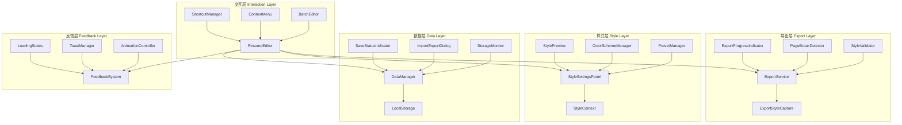

# 设计文档：编辑器用户体验增强

## 概述

本设计文档描述了 AI 简历编辑器的用户体验增强方案，重点关注五个核心领域：

1. **导出功能体验优化** - 进度显示、多页分页、样式一致性
2. **样式设置面板交互优化** - 实时预览、配色管理、预设方案
3. **数据持久化体验优化** - 自动保存反馈、数据导入导出、存储状态
4. **编辑器交互细节优化** - 快捷操作、上下文菜单、批量编辑
5. **视觉反馈与微交互优化** - 加载状态、操作确认、过渡动画

## 架构

### 系统架构图



### 目录结构

```
src/
├── components/
│   ├── export/
│   │   ├── ExportProgressIndicator.tsx   # 新增：导出进度指示器
│   │   ├── PageBreakPreview.tsx          # 新增：分页预览组件
│   │   └── StyleValidator.tsx            # 新增：样式验证组件
│   ├── editor/
│   │   ├── StyleSettingsPanel.tsx        # 更新：增强样式设置面板
│   │   ├── ColorSchemeManager.tsx        # 新增：配色方案管理器
│   │   ├── StylePresetSelector.tsx       # 新增：样式预设选择器
│   │   ├── ContextMenu.tsx               # 新增：上下文菜单
│   │   └── BatchEditToolbar.tsx          # 新增：批量编辑工具栏
│   ├── feedback/
│   │   ├── SaveStatusIndicator.tsx       # 新增：保存状态指示器
│   │   ├── LoadingOverlay.tsx            # 新增：加载遮罩层
│   │   └── ConfirmDialog.tsx             # 新增：确认对话框
│   └── data/
│       ├── ImportExportDialog.tsx        # 新增：导入导出对话框
│       └── StorageMonitor.tsx            # 新增：存储空间监控
├── hooks/
│   ├── useExportProgress.ts              # 新增：导出进度 Hook
│   ├── useColorSchemes.ts                # 新增：配色方案 Hook
│   ├── useContextMenu.ts                 # 新增：上下文菜单 Hook
│   ├── useBatchSelection.ts              # 新增：批量选择 Hook
│   └── useStorageMonitor.ts              # 新增：存储监控 Hook
├── services/
│   ├── exportStyleCapture.ts             # 更新：增强导出样式捕获
│   ├── pageBreakService.ts               # 新增：分页服务
│   └── dataExportService.ts              # 新增：数据导出服务
└── utils/
    ├── storageUtils.ts                   # 新增：存储工具函数
    └── animationUtils.ts                 # 新增：动画工具函数
```

## 组件和接口

### 1. 导出进度指示器

```typescript
// src/components/export/ExportProgressIndicator.tsx
interface ExportProgressIndicatorProps {
  /** 当前进度 (0-100) */
  progress: number
  /** 当前步骤描述 */
  currentStep: ExportStep
  /** 当前页码（多页导出时） */
  currentPage?: number
  /** 总页数（多页导出时） */
  totalPages?: number
  /** 预估剩余时间（秒） */
  estimatedTimeRemaining?: number
  /** 是否可取消 */
  cancellable?: boolean
  /** 取消回调 */
  onCancel?: () => void
  /** 导出状态 */
  status: 'preparing' | 'rendering' | 'generating' | 'complete' | 'error'
  /** 错误信息 */
  errorMessage?: string
  /** 重试回调 */
  onRetry?: () => void
}

type ExportStep = 
  | 'preparing-styles'    // 准备样式
  | 'loading-fonts'       // 加载字体
  | 'rendering-page'      // 渲染页面
  | 'generating-file'     // 生成文件
  | 'complete'            // 完成
  | 'error'               // 错误
```

### 2. 分页检测服务

```typescript
// src/services/pageBreakService.ts
interface PageBreakConfig {
  /** 页面高度（像素） */
  pageHeight: number
  /** 页边距（像素） */
  margin: number
  /** 最小孤行高度 */
  minOrphanHeight: number
}

interface ContentBlock {
  /** 元素 */
  element: HTMLElement
  /** 块类型 */
  type: 'section-header' | 'section-content' | 'list-item' | 'paragraph'
  /** 高度 */
  height: number
  /** 是否可分割 */
  splittable: boolean
}

interface PageBreakResult {
  /** 分页位置（像素） */
  breakPositions: number[]
  /** 总页数 */
  totalPages: number
  /** 被分割的内容块 */
  splitBlocks: ContentBlock[]
}

class PageBreakService {
  /** 检测最佳分页位置 */
  detectBreakPositions(container: HTMLElement, config: PageBreakConfig): PageBreakResult
  
  /** 检查内容块是否会被分割 */
  checkBlockIntegrity(block: ContentBlock, breakPosition: number): boolean
  
  /** 获取建议的分页位置 */
  getSuggestedBreakPosition(currentPosition: number, blocks: ContentBlock[]): number
}
```

### 3. 配色方案管理器

```typescript
// src/components/editor/ColorSchemeManager.tsx
interface ColorScheme {
  /** 唯一标识 */
  id: string
  /** 方案名称 */
  name: string
  /** 主色 */
  primary: string
  /** 次色 */
  secondary: string
  /** 强调色 */
  accent: string
  /** 文本色 */
  text: string
  /** 背景色 */
  background: string
  /** 是否为预设方案 */
  isPreset: boolean
  /** 创建时间 */
  createdAt?: Date
}

interface ColorSchemeManagerProps {
  /** 当前配色方案 */
  currentScheme: ColorScheme
  /** 选择配色方案回调 */
  onSelect: (scheme: ColorScheme) => void
  /** 保存自定义方案回调 */
  onSave: (scheme: ColorScheme) => void
  /** 删除方案回调 */
  onDelete: (schemeId: string) => void
}

// src/hooks/useColorSchemes.ts
interface UseColorSchemesReturn {
  /** 预设配色方案 */
  presetSchemes: ColorScheme[]
  /** 自定义配色方案 */
  customSchemes: ColorScheme[]
  /** 保存自定义方案 */
  saveScheme: (scheme: Omit<ColorScheme, 'id' | 'createdAt'>) => void
  /** 删除自定义方案 */
  deleteScheme: (schemeId: string) => void
  /** 重命名方案 */
  renameScheme: (schemeId: string, newName: string) => void
  /** 导入方案 */
  importScheme: (scheme: ColorScheme) => void
}
```

### 4. 保存状态指示器

```typescript
// src/components/feedback/SaveStatusIndicator.tsx
interface SaveStatusIndicatorProps {
  /** 保存状态 */
  status: 'saved' | 'saving' | 'unsaved' | 'error'
  /** 最后保存时间 */
  lastSavedAt: Date | null
  /** 保存历史记录 */
  saveHistory?: SaveHistoryItem[]
  /** 手动保存回调 */
  onManualSave: () => void
  /** 重试回调 */
  onRetry?: () => void
}

interface SaveHistoryItem {
  /** 保存时间 */
  timestamp: Date
  /** 是否成功 */
  success: boolean
}
```

### 5. 上下文菜单

```typescript
// src/components/editor/ContextMenu.tsx
interface ContextMenuItem {
  /** 菜单项标识 */
  id: string
  /** 显示标签 */
  label: string
  /** 图标 */
  icon?: React.ReactNode
  /** 快捷键 */
  shortcut?: string
  /** 是否禁用 */
  disabled?: boolean
  /** 是否为危险操作 */
  danger?: boolean
  /** 点击回调 */
  onClick: () => void
  /** 分隔线 */
  divider?: boolean
}

interface ContextMenuProps {
  /** 菜单项 */
  items: ContextMenuItem[]
  /** 位置 */
  position: { x: number; y: number }
  /** 关闭回调 */
  onClose: () => void
}

// src/hooks/useContextMenu.ts
interface UseContextMenuReturn {
  /** 是否显示菜单 */
  isOpen: boolean
  /** 菜单位置 */
  position: { x: number; y: number }
  /** 打开菜单 */
  openMenu: (event: React.MouseEvent, items: ContextMenuItem[]) => void
  /** 关闭菜单 */
  closeMenu: () => void
  /** 当前菜单项 */
  menuItems: ContextMenuItem[]
}
```

### 6. 批量编辑工具栏

```typescript
// src/components/editor/BatchEditToolbar.tsx
interface BatchEditToolbarProps {
  /** 选中的条目数量 */
  selectedCount: number
  /** 批量删除回调 */
  onBatchDelete: () => void
  /** 批量移动回调 */
  onBatchMove: (direction: 'up' | 'down') => void
  /** 批量复制回调 */
  onBatchCopy: () => void
  /** 取消选择回调 */
  onClearSelection: () => void
  /** 全选回调 */
  onSelectAll: () => void
}

// src/hooks/useBatchSelection.ts
interface UseBatchSelectionReturn<T> {
  /** 选中的项目 ID 列表 */
  selectedIds: string[]
  /** 是否有选中项 */
  hasSelection: boolean
  /** 选中数量 */
  selectionCount: number
  /** 切换选择 */
  toggleSelection: (id: string) => void
  /** 范围选择 */
  rangeSelect: (startId: string, endId: string) => void
  /** 全选 */
  selectAll: (ids: string[]) => void
  /** 清除选择 */
  clearSelection: () => void
  /** 检查是否选中 */
  isSelected: (id: string) => boolean
}
```

### 7. 数据导入导出对话框

```typescript
// src/components/data/ImportExportDialog.tsx
interface ImportExportDialogProps {
  /** 是否打开 */
  isOpen: boolean
  /** 关闭回调 */
  onClose: () => void
  /** 当前简历数据 */
  resumeData: ResumeData
  /** 当前样式配置 */
  styleConfig: StyleConfig
  /** 导入回调 */
  onImport: (data: ImportedData, mode: 'replace' | 'merge') => void
}

interface ImportedData {
  /** 简历数据 */
  resumeData?: ResumeData
  /** 样式配置 */
  styleConfig?: StyleConfig
  /** 配色方案 */
  colorSchemes?: ColorScheme[]
  /** 版本信息 */
  version: string
  /** 导出时间 */
  exportedAt: string
}

interface ExportPackage extends ImportedData {
  /** 应用名称 */
  appName: string
  /** 应用版本 */
  appVersion: string
}
```

### 8. 存储空间监控

```typescript
// src/components/data/StorageMonitor.tsx
interface StorageMonitorProps {
  /** 是否显示详情 */
  showDetails?: boolean
  /** 警告阈值（百分比） */
  warningThreshold?: number
}

// src/hooks/useStorageMonitor.ts
interface StorageUsage {
  /** 已使用空间（字节） */
  used: number
  /** 总空间（字节） */
  total: number
  /** 使用百分比 */
  percentage: number
  /** 各类数据占用 */
  breakdown: {
    resumes: number
    versionHistory: number
    colorSchemes: number
    settings: number
    other: number
  }
}

interface UseStorageMonitorReturn {
  /** 存储使用情况 */
  usage: StorageUsage
  /** 是否接近上限 */
  isNearLimit: boolean
  /** 清理旧数据 */
  cleanupOldData: (options: CleanupOptions) => Promise<number>
  /** 刷新使用情况 */
  refresh: () => void
}

interface CleanupOptions {
  /** 清理版本历史 */
  versionHistory?: boolean
  /** 保留最近 N 个版本 */
  keepRecentVersions?: number
  /** 清理未使用的配色方案 */
  unusedColorSchemes?: boolean
}
```

## 数据模型

### 导出进度状态

```typescript
interface ExportProgress {
  /** 进度百分比 (0-100) */
  percentage: number
  /** 当前步骤 */
  step: ExportStep
  /** 当前页码 */
  currentPage: number
  /** 总页数 */
  totalPages: number
  /** 开始时间 */
  startTime: number
  /** 预估完成时间 */
  estimatedEndTime: number
  /** 状态 */
  status: 'idle' | 'running' | 'complete' | 'error' | 'cancelled'
  /** 错误信息 */
  error?: string
}
```

### 样式预设方案

```typescript
interface StylePreset {
  /** 预设 ID */
  id: string
  /** 预设名称 */
  name: string
  /** 英文名称 */
  nameEn: string
  /** 描述 */
  description: string
  /** 英文描述 */
  descriptionEn: string
  /** 适用行业 */
  industry: 'tech' | 'finance' | 'creative' | 'academic' | 'general'
  /** 是否热门 */
  isPopular: boolean
  /** 配色方案 */
  colorScheme: ColorScheme
  /** 字体配置 */
  fontConfig: {
    family: string
    sizes: {
      name: number
      title: number
      content: number
      small: number
    }
  }
  /** 间距配置 */
  spacingConfig: {
    section: number
    item: number
    line: number
  }
  /** 布局配置 */
  layoutConfig: {
    headerLayout: 'horizontal' | 'vertical' | 'centered'
    contactLayout: 'inline' | 'grouped' | 'sidebar'
    columns: 1 | 2
  }
}

// 预设方案列表
const STYLE_PRESETS: StylePreset[] = [
  // 科技行业
  { id: 'tech-modern', name: '科技现代', industry: 'tech', isPopular: true, ... },
  { id: 'tech-minimal', name: '科技极简', industry: 'tech', ... },
  { id: 'tech-dark', name: '科技暗黑', industry: 'tech', ... },
  
  // 金融行业
  { id: 'finance-classic', name: '金融经典', industry: 'finance', isPopular: true, ... },
  { id: 'finance-elegant', name: '金融优雅', industry: 'finance', ... },
  { id: 'finance-pro', name: '金融专业', industry: 'finance', ... },
  
  // 创意行业
  { id: 'creative-bold', name: '创意大胆', industry: 'creative', isPopular: true, ... },
  { id: 'creative-artistic', name: '艺术风格', industry: 'creative', ... },
  { id: 'creative-gradient', name: '渐变创意', industry: 'creative', ... },
  
  // 学术行业
  { id: 'academic-formal', name: '学术正式', industry: 'academic', isPopular: true, ... },
  { id: 'academic-clean', name: '学术简洁', industry: 'academic', ... },
  
  // 通用
  { id: 'general-professional', name: '通用专业', industry: 'general', isPopular: true, ... },
]
```

### 快捷键配置

```typescript
interface ShortcutConfig {
  /** 快捷键标识 */
  id: string
  /** 显示名称 */
  name: string
  /** 默认快捷键 */
  defaultKey: string
  /** 用户自定义快捷键 */
  customKey?: string
  /** 快捷键描述 */
  description: string
  /** 是否启用 */
  enabled: boolean
}

const DEFAULT_SHORTCUTS: ShortcutConfig[] = [
  { id: 'save', name: '保存', defaultKey: 'Ctrl+S', description: '手动保存当前简历', enabled: true },
  { id: 'undo', name: '撤销', defaultKey: 'Ctrl+Z', description: '撤销上一步操作', enabled: true },
  { id: 'redo', name: '重做', defaultKey: 'Ctrl+Shift+Z', description: '重做已撤销的操作', enabled: true },
  { id: 'export', name: '导出', defaultKey: 'Ctrl+P', description: '打开导出对话框', enabled: true },
  { id: 'duplicate', name: '复制条目', defaultKey: 'Ctrl+D', description: '复制当前选中的条目', enabled: true },
  { id: 'delete', name: '删除', defaultKey: 'Delete', description: '删除选中的条目', enabled: true },
  { id: 'selectAll', name: '全选', defaultKey: 'Ctrl+A', description: '全选当前模块的所有条目', enabled: true },
]
```

### 动画配置

```typescript
interface AnimationConfig {
  /** 是否启用动画 */
  enabled: boolean
  /** 是否尊重系统减少动画偏好 */
  respectReducedMotion: boolean
  /** 动画时长倍数 */
  durationMultiplier: number
}

interface AnimationPreset {
  /** 淡入淡出 */
  fade: {
    initial: { opacity: number }
    animate: { opacity: number }
    exit: { opacity: number }
    transition: { duration: number }
  }
  /** 滑动 */
  slide: {
    initial: { x: number; opacity: number }
    animate: { x: number; opacity: number }
    exit: { x: number; opacity: number }
    transition: { duration: number; ease: string }
  }
  /** 缩放 */
  scale: {
    initial: { scale: number; opacity: number }
    animate: { scale: number; opacity: number }
    exit: { scale: number; opacity: number }
    transition: { duration: number }
  }
  /** 高度展开 */
  expand: {
    initial: { height: number; opacity: number }
    animate: { height: string; opacity: number }
    exit: { height: number; opacity: number }
    transition: { duration: number }
  }
}
```


## 正确性属性

*属性是系统在所有有效执行中应保持为真的特征或行为——本质上是关于系统应该做什么的形式化陈述。属性是人类可读规范与机器可验证正确性保证之间的桥梁。*

### Property 1: 导出进度状态有效性

*For any* 导出操作，进度百分比 SHALL 始终在 0-100 范围内，当前页码 SHALL 始终 >= 1 且 <= 总页数，且每个导出步骤 SHALL 有对应的有效描述。

**Validates: Requirements 1.1, 1.2, 1.3**

### Property 2: 分页位置约束

*For any* 包含多个内容块的简历，分页位置 SHALL NOT 出现在段落中间、列表项中间或标题与其内容之间，且 SHALL 优先选择模块边界作为分页点。

**Validates: Requirements 2.2, 2.4**

### Property 3: 页边距一致性

*For any* 多页导出结果，所有页面的页边距值 SHALL 完全相同。

**Validates: Requirements 2.3**

### Property 4: 标题重复逻辑

*For any* 被分页分割的内容块，下一页的顶部 SHALL 包含该模块的标题重复。

**Validates: Requirements 2.7**

### Property 5: 导出样式一致性

*For any* 导出操作，导出文件的字体、颜色、间距和布局 SHALL 与预览效果一致，所有 CSS 变量 SHALL 被正确解析为实际值。

**Validates: Requirements 3.1, 3.2, 3.3**

### Property 6: 字体回退逻辑

*For any* 使用自定义字体的导出，当字体不可用时，SHALL 应用预定义的备用字体。

**Validates: Requirements 3.4**

### Property 7: 样式验证差异检测

*For any* 导出前的样式验证，当预览样式与导出样式存在差异时，SHALL 返回差异列表。

**Validates: Requirements 3.6**

### Property 8: 样式预览响应时间

*For any* 颜色或字体大小的调整操作，预览更新 SHALL 在 100ms 内完成。

**Validates: Requirements 4.1, 4.2**

### Property 9: 滑块与预览同步

*For any* 滑块值的变化，预览状态 SHALL 与滑块当前值保持同步。

**Validates: Requirements 4.5**

### Property 10: 配色方案持久化

*For any* 保存的自定义配色方案，SHALL 被存储到本地存储中，且 SHALL 出现在配色方案列表中，且 SHALL 可被正确加载和应用。

**Validates: Requirements 5.1, 5.2, 5.3, 5.7**

### Property 11: 配色方案 CRUD 操作

*For any* 配色方案的删除或重命名操作，操作后的配色方案列表 SHALL 反映该变更。

**Validates: Requirements 5.4**

### Property 12: 样式预设数量和分类

*For any* 调用获取样式预设的操作，返回的预设数量 SHALL >= 12，且每个预设 SHALL 有有效的行业分类和描述。

**Validates: Requirements 6.1, 6.2, 6.4**

### Property 13: 热门预设标记

*For any* 样式预设列表，至少有一个预设 SHALL 被标记为热门。

**Validates: Requirements 6.7**

### Property 14: 保存状态机

*For any* 保存操作序列，保存状态 SHALL 遵循有效的状态转换：idle -> saving -> (saved | error)，且每个状态 SHALL 有对应的正确显示。

**Validates: Requirements 7.2, 7.3, 7.4, 7.5**

### Property 15: 保存历史记录限制

*For any* 保存历史记录，记录数量 SHALL <= 5，且按时间倒序排列。

**Validates: Requirements 7.8**

### Property 16: 数据导入导出往返

*For any* 有效的简历数据，导出为 JSON 后再导入 SHALL 产生等价的数据对象。

**Validates: Requirements 8.1, 8.2**

### Property 17: 数据格式验证

*For any* 导入的数据，无效格式 SHALL 被检测并返回具体的错误信息。

**Validates: Requirements 8.3, 8.4**

### Property 18: 导入模式

*For any* 数据导入操作，覆盖模式 SHALL 完全替换现有数据，合并模式 SHALL 保留现有数据并添加新数据。

**Validates: Requirements 8.5**

### Property 19: 完整数据包导出

*For any* 完整数据包导出，导出结果 SHALL 包含简历数据和样式配置。

**Validates: Requirements 8.7**

### Property 20: 存储使用量计算

*For any* 存储监控调用，返回的使用量 SHALL 等于各类数据占用之和，且百分比 SHALL 正确反映使用量与总空间的比例。

**Validates: Requirements 9.1, 9.4**

### Property 21: 存储警告阈值

*For any* 存储使用量超过 80% 的情况，SHALL 触发警告状态。

**Validates: Requirements 9.2**

### Property 22: 自定义快捷键持久化

*For any* 自定义的快捷键配置，SHALL 被保存并在下次加载时正确应用。

**Validates: Requirements 10.7**

### Property 23: 上下文菜单内容有效性

*For any* 右键点击操作，上下文菜单 SHALL 根据点击位置显示相关的操作选项，每个选项 SHALL 有对应的快捷键显示。

**Validates: Requirements 11.1, 11.2, 11.3, 11.4**

### Property 24: 上下文菜单操作执行

*For any* 菜单项选择，SHALL 执行对应的操作并关闭菜单。

**Validates: Requirements 11.5**

### Property 25: 上下文菜单位置调整

*For any* 靠近屏幕边缘的右键点击，菜单位置 SHALL 被调整以确保完全可见。

**Validates: Requirements 11.7**

### Property 26: 批量选择操作

*For any* 批量选择操作，选中数量 SHALL 正确反映实际选中的条目数，批量删除 SHALL 移除所有选中条目，批量复制 SHALL 增加等量的新条目，批量移动 SHALL 保持选中条目的相对顺序。

**Validates: Requirements 12.1, 12.3, 12.4, 12.5, 12.7**

### Property 27: 批量操作工具栏显示

*For any* 选中数量 > 0 的状态，批量操作工具栏 SHALL 显示。

**Validates: Requirements 12.2**

### Property 28: 长时间加载提示

*For any* 加载时间超过 2 秒的操作，SHALL 显示加载进度或提示信息。

**Validates: Requirements 13.4**

### Property 29: 加载期间按钮禁用

*For any* 加载状态，可能导致冲突的操作按钮 SHALL 被禁用。

**Validates: Requirements 13.5**

### Property 30: 加载失败错误显示

*For any* 加载失败的情况，SHALL 显示错误信息和重试选项。

**Validates: Requirements 13.7**

### Property 31: Toast 提示堆叠

*For any* 同时存在的多个 Toast 提示，SHALL 按时间顺序堆叠显示。

**Validates: Requirements 14.5**

### Property 32: Toast 生命周期

*For any* 成功类型的 Toast，SHALL 在 3 秒后自动关闭；错误类型的 Toast SHALL 保持显示直到用户手动关闭。

**Validates: Requirements 14.6**

### Property 33: 动画时长范围

*For any* 动画配置，时长值 SHALL 在 150-300ms 范围内。

**Validates: Requirements 15.4**

### Property 34: 动画禁用功能

*For any* 禁用动画的设置，所有动画 SHALL 被跳过或使用 0ms 时长。

**Validates: Requirements 15.5**

### Property 35: 动画期间交互可用性

*For any* 动画播放期间，用户交互 SHALL NOT 被阻塞。

**Validates: Requirements 15.7**

### Property 36: 低性能设备动画适配

*For any* 检测为低性能的设备，动画 SHALL 被自动简化或禁用。

**Validates: Requirements 15.8**

## 错误处理

### 导出错误处理

```typescript
// 导出错误类型
type ExportError = 
  | { type: 'font-load-timeout'; fontFamily: string }
  | { type: 'canvas-render-failed'; reason: string }
  | { type: 'pdf-generation-failed'; reason: string }
  | { type: 'file-download-blocked'; reason: string }
  | { type: 'cancelled'; reason: 'user-cancelled' }

// 错误处理策略
const handleExportError = (error: ExportError): ErrorResponse => {
  switch (error.type) {
    case 'font-load-timeout':
      return {
        message: `字体 "${error.fontFamily}" 加载超时，将使用备用字体`,
        action: 'continue-with-fallback',
        recoverable: true
      }
    case 'canvas-render-failed':
      return {
        message: '页面渲染失败，请刷新页面后重试',
        action: 'retry',
        recoverable: true
      }
    case 'pdf-generation-failed':
      return {
        message: 'PDF 生成失败，请尝试导出为图片格式',
        action: 'suggest-alternative',
        recoverable: true
      }
    case 'file-download-blocked':
      return {
        message: '下载被浏览器阻止，请允许下载权限',
        action: 'request-permission',
        recoverable: true
      }
    case 'cancelled':
      return {
        message: '导出已取消',
        action: 'none',
        recoverable: false
      }
  }
}
```

### 存储错误处理

```typescript
// 存储错误类型
type StorageError =
  | { type: 'quota-exceeded'; currentUsage: number; limit: number }
  | { type: 'parse-error'; key: string; reason: string }
  | { type: 'write-failed'; key: string; reason: string }
  | { type: 'storage-unavailable'; reason: string }

// 错误处理策略
const handleStorageError = (error: StorageError): ErrorResponse => {
  switch (error.type) {
    case 'quota-exceeded':
      return {
        message: '存储空间已满，请清理旧数据或导出备份',
        action: 'show-cleanup-dialog',
        recoverable: true,
        suggestions: [
          '删除旧版本历史',
          '删除未使用的配色方案',
          '导出数据后清理'
        ]
      }
    case 'parse-error':
      return {
        message: `数据 "${error.key}" 解析失败，将使用默认值`,
        action: 'use-default',
        recoverable: true
      }
    case 'write-failed':
      return {
        message: '保存失败，请检查浏览器存储权限',
        action: 'retry',
        recoverable: true
      }
    case 'storage-unavailable':
      return {
        message: '本地存储不可用，数据将不会被保存',
        action: 'warn-user',
        recoverable: false
      }
  }
}
```

### 数据导入错误处理

```typescript
// 导入验证错误
interface ImportValidationError {
  field: string
  message: string
  value?: unknown
}

// 验证导入数据
const validateImportData = (data: unknown): ImportValidationError[] => {
  const errors: ImportValidationError[] = []
  
  if (!data || typeof data !== 'object') {
    errors.push({ field: 'root', message: '无效的数据格式' })
    return errors
  }
  
  const obj = data as Record<string, unknown>
  
  // 验证版本
  if (!obj.version || typeof obj.version !== 'string') {
    errors.push({ field: 'version', message: '缺少版本信息' })
  }
  
  // 验证简历数据
  if (obj.resumeData) {
    const resumeErrors = validateResumeData(obj.resumeData)
    errors.push(...resumeErrors)
  }
  
  // 验证样式配置
  if (obj.styleConfig) {
    const styleErrors = validateStyleConfig(obj.styleConfig)
    errors.push(...styleErrors)
  }
  
  return errors
}
```

## 测试策略

### 单元测试

- 测试 `PageBreakService` 的分页位置检测逻辑
- 测试 `useColorSchemes` hook 的 CRUD 操作
- 测试 `useBatchSelection` hook 的选择状态管理
- 测试 `useStorageMonitor` hook 的存储计算
- 测试数据导入验证逻辑
- 测试上下文菜单位置计算

### 属性测试

使用 fast-check 库进行属性测试，每个测试最少运行 100 次迭代：

1. **导出进度状态有效性测试**
   - 生成随机的导出进度状态
   - 验证进度值、页码、步骤描述的有效性
   - **Feature: editor-ux-enhancement, Property 1: 导出进度状态有效性**

2. **分页位置约束测试**
   - 生成随机的内容块序列
   - 验证分页位置不违反约束
   - **Feature: editor-ux-enhancement, Property 2: 分页位置约束**

3. **配色方案持久化测试**
   - 生成随机的配色方案
   - 验证保存、加载、应用的往返一致性
   - **Feature: editor-ux-enhancement, Property 10: 配色方案持久化**

4. **数据导入导出往返测试**
   - 生成随机的简历数据
   - 验证导出后导入产生等价数据
   - **Feature: editor-ux-enhancement, Property 16: 数据导入导出往返**

5. **批量选择操作测试**
   - 生成随机的条目列表和选择操作
   - 验证批量操作后的状态正确性
   - **Feature: editor-ux-enhancement, Property 26: 批量选择操作**

6. **Toast 生命周期测试**
   - 生成随机的 Toast 类型和时间序列
   - 验证自动关闭和手动关闭行为
   - **Feature: editor-ux-enhancement, Property 32: Toast 生命周期**

### 测试配置

```typescript
// jest.config.js
module.exports = {
  testEnvironment: 'jsdom',
  setupFilesAfterEnv: ['<rootDir>/jest.setup.js'],
  moduleNameMapper: {
    '^@/(.*)$': '<rootDir>/src/$1'
  }
}

// 属性测试最小迭代次数
const PBT_MIN_RUNS = 100

// fast-check 配置
const fcConfig = {
  numRuns: PBT_MIN_RUNS,
  verbose: true,
  seed: Date.now()
}
```

### 集成测试

- 测试导出流程的完整性（从点击导出到文件下载）
- 测试样式设置面板与预览的联动
- 测试数据导入导出的完整流程
- 测试批量编辑的完整操作流程

