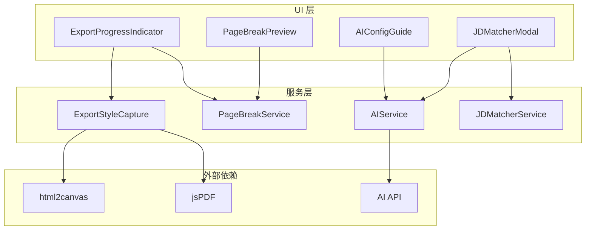
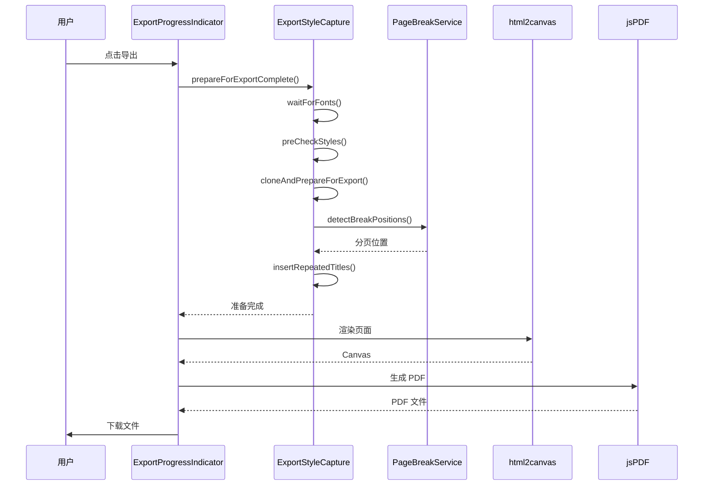

# 设计文档

## 概述

本设计文档描述了 AI 简历编辑器项目中导出功能优化和 AI 功能增强的技术实现方案。主要解决导出样式不一致问题，优化多页导出体验，并增强 AI 相关功能。

## 架构

### 整体架构



### 导出流程



## 组件和接口

### ExportStyleCapture 服务增强

```typescript
interface EnhancedExportOptions {
  /** 是否验证样式一致性 */
  validateStyles?: boolean
  /** 是否执行样式预检 */
  preCheck?: boolean
  /** 是否处理标题重复 */
  handleTitleRepetition?: boolean
  /** 分页位置列表 */
  pageBreakPositions?: number[]
  /** 标题重复配置 */
  titleRepetitionConfig?: TitleRepetitionConfig
  /** 导出格式 */
  format?: 'pdf' | 'png' | 'jpg'
  /** 缩放比例 */
  scale?: number
}

interface ExportResult {
  /** 是否成功 */
  success: boolean
  /** 导出的文件 Blob */
  blob?: Blob
  /** 错误信息 */
  error?: string
  /** 样式验证结果 */
  validationResult?: StyleValidationResult
  /** 样式预检结果 */
  preCheckResult?: StylePreCheckResult
}
```

### PageBreakService 增强

```typescript
interface EnhancedPageBreakConfig extends PageBreakConfig {
  /** 是否启用智能分页 */
  smartBreak?: boolean
  /** 标题保护高度（确保标题后有足够内容） */
  titleProtectionHeight?: number
  /** 列表项最小保留数量 */
  minListItemsPerPage?: number
}

interface PageBreakPreviewInfo {
  /** 总高度 */
  totalHeight: number
  /** 页数 */
  pageCount: number
  /** 分页位置 */
  breakPositions: number[]
  /** 警告信息 */
  warnings: string[]
  /** 每页内容摘要 */
  pageSummaries: PageSummary[]
}

interface PageSummary {
  /** 页码 */
  pageNumber: number
  /** 页面高度 */
  height: number
  /** 包含的模块 */
  sections: string[]
  /** 是否有被分割的内容 */
  hasSplitContent: boolean
}
```

### AIService 增强

```typescript
interface StreamingOptions {
  /** 流式输出回调 */
  onStream?: (content: string) => void
  /** 进度回调 */
  onProgress?: (progress: number) => void
  /** 取消信号 */
  abortSignal?: AbortSignal
}

interface AIGenerationResult {
  /** 生成的建议列表 */
  suggestions: string[]
  /** 使用的模型 */
  model: string
  /** 生成耗时（毫秒） */
  duration: number
  /** Token 使用量 */
  tokenUsage?: {
    prompt: number
    completion: number
    total: number
  }
}
```

### JDMatcherService 增强

```typescript
interface EnhancedJDMatchResult extends JDMatchResult {
  /** 检测到的行业类型 */
  detectedIndustry: IndustryType
  /** 分类后的匹配关键词 */
  categorizedMatched: CategorizedKeywords
  /** 分类后的缺失关键词 */
  categorizedMissing: CategorizedKeywords
  /** 匹配等级 */
  matchLevel: 'high' | 'medium' | 'low'
  /** 优化优先级建议 */
  prioritizedSuggestions: PrioritizedSuggestion[]
}

interface PrioritizedSuggestion extends JDSuggestion {
  /** 优先级 */
  priority: 'high' | 'medium' | 'low'
  /** 预估影响分数 */
  estimatedImpact: number
}
```

## 数据模型

### 导出状态模型

```typescript
interface ExportState {
  /** 导出状态 */
  status: 'idle' | 'preparing' | 'rendering' | 'generating' | 'complete' | 'error'
  /** 当前步骤 */
  currentStep: ExportStep
  /** 进度百分比 */
  progress: number
  /** 当前页码 */
  currentPage?: number
  /** 总页数 */
  totalPages?: number
  /** 预估剩余时间（秒） */
  estimatedTimeRemaining?: number
  /** 错误信息 */
  errorMessage?: string
  /** 是否可取消 */
  cancellable: boolean
}

type ExportStep = 
  | 'preparing-styles'
  | 'loading-fonts'
  | 'rendering-page'
  | 'generating-file'
  | 'complete'
  | 'error'
```

### AI 配置模型

```typescript
interface AIConfig {
  /** 是否启用 */
  enabled: boolean
  /** 提供商 */
  provider: 'free' | 'siliconflow' | 'deepseek' | 'custom'
  /** API 密钥 */
  apiKey?: string
  /** 模型名称 */
  modelName: string
  /** 自定义端点 */
  customEndpoint?: string
  /** 温度参数 */
  temperature?: number
  /** 最大 Token 数 */
  maxTokens?: number
}

interface AIConfigStatus {
  /** 是否已配置 */
  isConfigured: boolean
  /** 是否已启用 */
  isEnabled: boolean
  /** 提供商 */
  provider: string | null
  /** 模型名称 */
  modelName: string | null
  /** 是否有 API 密钥 */
  hasApiKey: boolean
}
```


## 正确性属性

*正确性属性是一种应该在系统所有有效执行中保持为真的特征或行为——本质上是关于系统应该做什么的形式化陈述。属性作为人类可读规范和机器可验证正确性保证之间的桥梁。*

### Property 1: 导出样式往返一致性

*对于任意* 包含样式配置的预览元素，执行 `cloneAndPrepareForExport` 后，克隆元素的关键计算样式（字体、颜色、间距、布局）应与原始元素一致。

**Validates: Requirements 1.1, 1.4**

### Property 2: CSS 变量解析完整性

*对于任意* 包含 CSS 变量的 HTML 元素，执行 `resolveCSSVariables` 后，元素及其所有子元素的内联样式中不应包含未解析的 `var()` 表达式。

**Validates: Requirements 1.2**

### Property 3: 字体备用覆盖

*对于任意* HTML 元素，执行 `handleCustomFonts` 后，元素的 `fontFamily` 样式应包含备用字体（如 `sans-serif`）。

**Validates: Requirements 1.3**

### Property 4: 样式预检问题检测

*对于任意* 包含已知问题（不可用字体、未解析 CSS 变量、无效颜色值）的 HTML 元素，`preCheckStyles` 应返回包含对应问题类型的结果。

**Validates: Requirements 1.5**

### Property 5: 样式验证差异检测

*对于任意* 两组不同的 `CapturedStyles` 对象，`validateStyleConsistency` 应正确识别所有差异，且差异数量等于实际不同属性的数量。

**Validates: Requirements 1.6**

### Property 6: 智能分页位置

*对于任意* 包含内容块的容器元素，`detectBreakPositions` 返回的分页位置不应落在不可分割块（section-header、list-item）的中间。

**Validates: Requirements 2.1, 2.2**

### Property 7: 标题重复正确性

*对于任意* 标题信息和配置，`createRepeatedTitle` 返回的元素应包含原始标题文本（可能带前缀），且具有正确的 CSS 类和数据属性。

**Validates: Requirements 2.3**

### Property 8: 进度值边界

*对于任意* 进度值输入，`ExportProgressIndicator` 组件显示的进度应在 0-100 范围内。

**Validates: Requirements 3.2**

### Property 9: AI 配置状态检测

*对于任意* localStorage 中的 AI 配置，`checkAIConfigStatus` 应正确判断配置是否完整（免费模型无需 API 密钥，其他模型需要）。

**Validates: Requirements 4.1**

### Property 10: AI 配置持久化往返

*对于任意* 有效的 `AIConfig` 对象，保存到 localStorage 后再读取，应得到等价的配置对象。

**Validates: Requirements 4.4**

### Property 11: AI 建议解析

*对于任意* 包含编号列表格式的 AI 响应文本，`parseSuggestions` 应返回至少 2 个独立的建议项。

**Validates: Requirements 5.2**

### Property 12: 行业检测准确性

*对于任意* 包含特定行业关键词的 JD 文本，`detectIndustry` 应返回对应的行业类型。

**Validates: Requirements 6.1**

### Property 13: JD 匹配分析完整性

*对于任意* 简历数据和关键词列表，`analyzeResume` 返回的 `matchedKeywords` 和 `missingKeywords` 的并集应等于输入的关键词列表，且匹配分数应在 0-100 范围内。

**Validates: Requirements 6.2, 6.3, 6.4**

## 错误处理

### 导出错误处理

| 错误类型 | 处理策略 | 用户提示 |
|---------|---------|---------|
| 字体加载超时 | 使用备用字体继续导出 | "部分字体加载失败，已使用备用字体" |
| CSS 变量未解析 | 使用默认值或跳过 | "部分样式变量未能解析" |
| 渲染失败 | 重试一次，失败则报错 | "渲染失败，请重试" |
| 文件生成失败 | 报错并提供重试选项 | "文件生成失败，请检查浏览器权限" |
| 内存不足 | 降低缩放比例重试 | "内容过大，已降低导出质量" |

### AI 服务错误处理

| 错误类型 | 处理策略 | 用户提示 |
|---------|---------|---------|
| 网络连接失败 | 提示检查网络 | "网络连接失败，请检查网络连接后重试" |
| API 密钥无效 | 提示重新配置 | "API 密钥无效，请检查配置" |
| 请求超时 | 自动重试一次 | "请求超时，正在重试..." |
| 服务不可用 | 建议稍后重试或使用免费模型 | "AI 服务暂时不可用，请稍后重试" |
| 响应格式错误 | 尝试解析或报错 | "AI 响应格式异常，请重试" |

## 测试策略

### 双重测试方法

本项目采用单元测试和属性测试相结合的测试策略：

- **单元测试**: 验证特定示例、边界情况和错误条件
- **属性测试**: 验证跨所有输入的通用属性

### 属性测试配置

- **测试框架**: fast-check (TypeScript 属性测试库)
- **最小迭代次数**: 每个属性测试至少 100 次迭代
- **标签格式**: `Feature: export-ai-enhancement, Property {number}: {property_text}`

### 测试文件结构

```
src/
├── services/
│   └── __tests__/
│       ├── exportStyleCapture.property.test.ts  # 属性 1-5
│       ├── pageBreakService.property.test.ts    # 属性 6-7
│       └── jdMatcher.property.test.ts           # 属性 12-13
├── components/
│   ├── export/
│   │   └── __tests__/
│   │       └── exportProgress.property.test.ts  # 属性 8
│   └── ai/
│       └── __tests__/
│           └── aiConfig.property.test.ts        # 属性 9-11
└── hooks/
    └── __tests__/
        └── useExportProgress.test.ts            # 单元测试
```

### 单元测试重点

- 导出流程的集成测试
- UI 组件的渲染测试
- 错误处理路径测试
- 边界条件测试（空内容、超大内容等）

### 属性测试重点

- 样式捕获和转换的一致性
- 分页算法的正确性
- JD 匹配算法的完整性
- 配置持久化的可靠性
