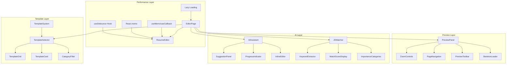

# Design Document: Resume Editor Optimization (Phase 2)

## Overview

本设计文档描述了 AI 简历编辑器的第二阶段优化方案，重点关注四个核心领域：
1. **页面性能优化** - 解决卡顿问题，提升响应速度
2. **预览面板设计优化** - 现代化的预览界面设计
3. **模板系统重构** - 删除旧模板、新增精美模板
4. **AI 功能优化** - 增强 AI 建议和 JD 匹配功能

## Architecture

### 系统架构图



### 目录结构

```
src/
├── components/
│   ├── editor/
│   │   ├── ThreeColumnLayout.tsx    # 三栏布局（已有）
│   │   ├── SectionNavigation.tsx    # 分区导航（已有）
│   │   └── OptimizedEditor.tsx      # 新增：优化的编辑器包装
│   ├── preview/
│   │   ├── PreviewPanel.tsx         # 新增：优化的预览面板
│   │   ├── PreviewToolbar.tsx       # 新增：预览工具栏
│   │   ├── ZoomControls.tsx         # 新增：缩放控制
│   │   ├── PageNavigation.tsx       # 新增：分页导航
│   │   └── PreviewSkeleton.tsx      # 新增：预览骨架屏
│   ├── templates/
│   │   ├── TemplateSelector.tsx     # 更新：优化的模板选择器
│   │   ├── TemplateGrid.tsx         # 新增：模板网格布局
│   │   └── TemplateCard.tsx         # 新增：模板卡片组件
│   └── ai/
│       ├── AIAssistant.tsx          # 更新：优化的 AI 助手
│       ├── SuggestionPanel.tsx      # 新增：建议面板
│       ├── ProgressIndicator.tsx    # 新增：进度指示器
│       └── JDMatcherModal.tsx       # 更新：优化的 JD 匹配
├── hooks/
│   ├── useDebounce.ts               # 已有：防抖 Hook
│   ├── useOptimizedState.ts         # 新增：优化状态管理
│   └── usePerformanceMonitor.ts     # 已有：性能监控
├── data/
│   └── templates.ts                 # 更新：重构模板数据
└── services/
    └── jdMatcher.ts                 # 更新：优化关键词提取
```

## Components and Interfaces

### 1. 性能优化组件

```typescript
// src/hooks/useOptimizedState.ts
interface UseOptimizedStateOptions<T> {
  debounceMs?: number;           // 防抖延迟（默认 300ms）
  batchUpdates?: boolean;        // 是否批量更新
  onUpdate?: (value: T) => void; // 更新回调
}

function useOptimizedState<T>(
  initialValue: T,
  options?: UseOptimizedStateOptions<T>
): [T, (value: T | ((prev: T) => T)) => void, boolean];
```

### 2. 预览面板组件

```typescript
// src/components/preview/PreviewPanel.tsx
interface PreviewPanelProps {
  resumeData: ResumeData;
  template: TemplateStyle;
  zoom: number;
  onZoomChange: (zoom: number) => void;
  showPageBreaks?: boolean;
  isDarkMode?: boolean;
  isLoading?: boolean;
}

// src/components/preview/PreviewToolbar.tsx
interface PreviewToolbarProps {
  zoom: number;
  onZoomChange: (zoom: number) => void;
  currentPage: number;
  totalPages: number;
  onPageChange: (page: number) => void;
  onExport: (format: 'pdf' | 'png' | 'jpg') => void;
}

// src/components/preview/ZoomControls.tsx
interface ZoomControlsProps {
  zoom: number;
  onZoomChange: (zoom: number) => void;
  minZoom?: number;  // 默认 50
  maxZoom?: number;  // 默认 200
  step?: number;     // 默认 10
}
```

### 3. 模板系统组件

```typescript
// src/components/templates/TemplateSelector.tsx
interface TemplateSelectorProps {
  templates: TemplateStyle[];
  selectedId: string;
  onSelect: (template: TemplateStyle) => void;
  onClose: () => void;
}

// src/components/templates/TemplateCard.tsx
interface TemplateCardProps {
  template: TemplateStyle;
  isSelected: boolean;
  onClick: () => void;
}

// src/data/templates.ts - 模板分类
type TemplateCategory = 'modern' | 'classic' | 'creative' | 'minimal';

interface TemplateStyle {
  id: string;
  name: string;
  nameEn: string;
  description: string;
  descriptionEn: string;
  preview: string;
  category: TemplateCategory;
  isPremium: boolean;
  hidden?: boolean;  // 标记为隐藏的模板不显示
  colors: ColorConfig;
  fonts: FontConfig;
  layout: LayoutConfig;
  components: ComponentConfig;
}
```

### 4. AI 功能组件

```typescript
// src/components/ai/SuggestionPanel.tsx
interface SuggestionPanelProps {
  suggestions: AISuggestion[];
  onApply: (suggestion: AISuggestion) => void;
  onRegenerate: () => void;
  isLoading: boolean;
}

interface AISuggestion {
  id: string;
  content: string;
  type: 'summary' | 'experience' | 'skills' | 'projects';
  confidence: number;
}

// src/components/ai/ProgressIndicator.tsx
interface ProgressIndicatorProps {
  progress: number;      // 0-100
  status: 'loading' | 'success' | 'error';
  message: string;
}

// src/services/jdMatcher.ts - 关键词重要性分类
interface CategorizedKeywords {
  required: string[];    // 必需关键词
  preferred: string[];   // 优先关键词
  niceToHave: string[];  // 加分项
}

interface JDMatchResult {
  score: number;
  matchedKeywords: CategorizedKeywords;
  missingKeywords: CategorizedKeywords;
  suggestions: JDSuggestion[];
}
```

## Data Models

### 优化后的模板数据结构

保留的高质量模板（删除 hidden: true 的模板）：

```typescript
// 保留的模板列表
const ACTIVE_TEMPLATES = [
  'modern-blue',        // 现代蓝调 - Modern
  'classic-elegant',    // 经典优雅 - Classic
  'minimal-clean',      // 极简清洁 - Minimal
  'github-markdown',    // GitHub 风格 - Modern
  'swiss-design',       // 瑞士设计 - Creative
  'nordic-minimal',     // 北欧极简 - Minimal
  'tech-minimal',       // 科技极简 - Modern
  'finance-pro',        // 金融精英 - Classic
  'creative-designer',  // 设计大师 - Creative
  'business-elite',     // 商务精英 - Classic
  'minimal-pro',        // 专业极简 - Minimal
  'elegant-sidebar',    // 优雅侧边栏 - Creative
  'gradient-header',    // 渐变头部 - Modern
];

// 删除的模板（hidden: true）
const REMOVED_TEMPLATES = [
  'modern-green',
  'creative-purple',
  'career-ui-designer',
  'career-frontend-developer',
  'career-product-manager',
  'elegant-rose',
  'tech-orange',
];
```

### 新增模板设计

```typescript
// 新增模板 1: 简约专业 (Minimal)
{
  id: 'clean-professional',
  name: '简约专业',
  nameEn: 'Clean Professional',
  description: '干净利落的专业设计，适合各行各业',
  descriptionEn: 'Clean and professional design suitable for all industries',
  category: 'minimal',
  colors: {
    primary: '#2d3748',
    secondary: '#718096',
    accent: '#4299e1',
    text: '#1a202c',
    background: '#ffffff'
  }
}

// 新增模板 2: 现代渐变 (Modern)
{
  id: 'modern-gradient',
  name: '现代渐变',
  nameEn: 'Modern Gradient',
  description: '时尚的渐变设计，展现现代感',
  descriptionEn: 'Stylish gradient design with modern aesthetics',
  category: 'modern',
  colors: {
    primary: '#667eea',
    secondary: '#764ba2',
    accent: '#f093fb',
    text: '#1f2937',
    background: '#ffffff'
  }
}
```

## Correctness Properties

*A property is a characteristic or behavior that should hold true across all valid executions of a system—essentially, a formal statement about what the system should do. Properties serve as the bridge between human-readable specifications and machine-verifiable correctness guarantees.*

### Property 1: Debounced Preview Updates

*For any* sequence of N rapid state changes (N changes within 300ms), the preview SHALL update at most once after the debounce period, reducing render count from N to 1.

**Validates: Requirements 1.1, 1.2**

### Property 2: Preview A4 Aspect Ratio

*For any* preview panel render, the paper element SHALL maintain the A4 aspect ratio (210:297 or approximately 1:1.414) within 1% tolerance.

**Validates: Requirements 2.1**

### Property 3: Zoom Value Bounds

*For any* zoom operation, the zoom value SHALL remain within the valid range of 50% to 200% inclusive.

**Validates: Requirements 2.3**

### Property 4: Page Number Validity

*For any* preview with content, the current page number SHALL be >= 1 and <= total pages, and total pages SHALL be >= 1.

**Validates: Requirements 2.9**

### Property 5: Hidden Templates Exclusion

*For any* call to getAvailableTemplates(), the result SHALL NOT contain any template with hidden === true.

**Validates: Requirements 3.1**

### Property 6: Template Category and Count

*For any* call to getAvailableTemplates(), the result SHALL contain at least 8 templates, and each template SHALL have a valid category from the set {modern, classic, creative, minimal}, with at least 2 templates per category.

**Validates: Requirements 3.2, 3.3, 3.10**

### Property 7: Template Selection State Update

*For any* template selection action, the currentTemplate state SHALL be updated to the selected template within one render cycle.

**Validates: Requirements 3.6**

### Property 8: Data Preservation on Template Change

*For any* resume data and any template selection, applying the template SHALL preserve all user-entered content (personalInfo, experience, education, skills, projects) without modification.

**Validates: Requirements 3.9**

### Property 9: JD Keyword Extraction

*For any* job description text containing identifiable skills/requirements, the JD_Matcher SHALL extract at least one keyword.

**Validates: Requirements 4.6**

### Property 10: Keyword Importance Categorization

*For any* set of missing keywords from JD analysis, each keyword SHALL be categorized into exactly one importance level: required, preferred, or niceToHave.

**Validates: Requirements 4.12**

## Error Handling

### 性能优化错误处理

```typescript
// 防抖更新失败时的回退策略
try {
  debouncedUpdate(newData);
} catch (error) {
  // 直接更新，跳过防抖
  console.warn('Debounced update failed, falling back to direct update');
  setData(newData);
}
```

### 模板加载错误处理

```typescript
// 模板加载失败时使用默认模板
try {
  const templates = getAvailableTemplates();
  if (templates.length === 0) {
    throw new Error('No templates available');
  }
} catch (error) {
  console.error('Template loading failed:', error);
  return [getDefaultTemplate()];
}
```

### AI 功能错误处理

```typescript
// AI 生成失败时的用户提示
try {
  const suggestions = await aiService.generateSuggestions(context);
} catch (error) {
  if (error instanceof AIConfigError) {
    showSetupGuide();
  } else if (error instanceof AIRateLimitError) {
    showError('请求过于频繁，请稍后重试');
  } else {
    showError('AI 生成失败，请检查网络连接');
  }
}
```

## Detailed Implementation

### 1. 性能优化实现

```typescript
// src/hooks/useOptimizedState.ts
'use client'

import { useState, useCallback, useRef, useEffect } from 'react'

export function useOptimizedState<T>(
  initialValue: T,
  options: { debounceMs?: number } = {}
) {
  const { debounceMs = 300 } = options
  const [value, setValue] = useState<T>(initialValue)
  const [isUpdating, setIsUpdating] = useState(false)
  const timeoutRef = useRef<NodeJS.Timeout>()
  const pendingValueRef = useRef<T>(initialValue)

  const debouncedSetValue = useCallback((newValue: T | ((prev: T) => T)) => {
    const resolvedValue = typeof newValue === 'function' 
      ? (newValue as (prev: T) => T)(pendingValueRef.current)
      : newValue
    
    pendingValueRef.current = resolvedValue
    setIsUpdating(true)

    if (timeoutRef.current) {
      clearTimeout(timeoutRef.current)
    }

    timeoutRef.current = setTimeout(() => {
      setValue(resolvedValue)
      setIsUpdating(false)
    }, debounceMs)
  }, [debounceMs])

  useEffect(() => {
    return () => {
      if (timeoutRef.current) {
        clearTimeout(timeoutRef.current)
      }
    }
  }, [])

  return [value, debouncedSetValue, isUpdating] as const
}
```

### 2. 预览面板实现

```typescript
// src/components/preview/PreviewPanel.tsx
'use client'

import React, { useMemo } from 'react'
import { motion } from 'framer-motion'
import PreviewToolbar from './PreviewToolbar'
import PreviewSkeleton from './PreviewSkeleton'

// A4 纸张常量
const A4_WIDTH = 210  // mm
const A4_HEIGHT = 297 // mm
const A4_ASPECT_RATIO = A4_HEIGHT / A4_WIDTH // 1.414

interface PreviewPanelProps {
  resumeData: ResumeData
  template: TemplateStyle
  zoom: number
  onZoomChange: (zoom: number) => void
  currentPage: number
  totalPages: number
  onPageChange: (page: number) => void
  isLoading?: boolean
  isDarkMode?: boolean
}

export function PreviewPanel({
  resumeData,
  template,
  zoom,
  onZoomChange,
  currentPage,
  totalPages,
  onPageChange,
  isLoading = false,
  isDarkMode = false
}: PreviewPanelProps) {
  // 计算纸张尺寸，保持 A4 比例
  const paperStyle = useMemo(() => ({
    width: '100%',
    maxWidth: '794px', // A4 at 96 DPI
    aspectRatio: `${A4_WIDTH} / ${A4_HEIGHT}`,
    transform: `scale(${zoom / 100})`,
    transformOrigin: 'top center',
    backgroundColor: isDarkMode ? '#1f2937' : '#ffffff',
    boxShadow: isDarkMode 
      ? '0 25px 50px -12px rgba(0, 0, 0, 0.5)' 
      : '0 4px 6px -1px rgba(0, 0, 0, 0.1), 0 2px 4px -1px rgba(0, 0, 0, 0.06)',
    borderRadius: '4px',
    transition: 'transform 0.2s ease-out'
  }), [zoom, isDarkMode])

  if (isLoading) {
    return <PreviewSkeleton />
  }

  return (
    <div className="flex flex-col h-full">
      {/* 工具栏 */}
      <PreviewToolbar
        zoom={zoom}
        onZoomChange={onZoomChange}
        currentPage={currentPage}
        totalPages={totalPages}
        onPageChange={onPageChange}
      />
      
      {/* 预览区域 */}
      <div className={`flex-1 overflow-auto p-4 ${isDarkMode ? 'bg-gray-900' : 'bg-gray-100'}`}>
        <div className="flex justify-center">
          <motion.div
            style={paperStyle}
            initial={{ opacity: 0, y: 20 }}
            animate={{ opacity: 1, y: 0 }}
            transition={{ duration: 0.3 }}
          >
            {/* 简历内容渲染 */}
            <div id="resume-preview" className="p-8">
              {/* ResumePreview 组件内容 */}
            </div>
          </motion.div>
        </div>
      </div>
    </div>
  )
}
```

### 3. 模板选择器实现

```typescript
// src/components/templates/TemplateSelector.tsx
'use client'

import React, { useMemo, useState } from 'react'
import { motion, AnimatePresence } from 'framer-motion'
import { X, Grid, List } from 'lucide-react'
import { TemplateStyle, TemplateCategory } from '@/types/template'
import { getAvailableTemplates } from '@/data/templates'
import TemplateCard from './TemplateCard'

interface TemplateSelectorProps {
  selectedId: string
  onSelect: (template: TemplateStyle) => void
  onClose: () => void
}

const CATEGORIES: { id: TemplateCategory; label: string; labelEn: string }[] = [
  { id: 'modern', label: '现代', labelEn: 'Modern' },
  { id: 'classic', label: '经典', labelEn: 'Classic' },
  { id: 'creative', label: '创意', labelEn: 'Creative' },
  { id: 'minimal', label: '极简', labelEn: 'Minimal' },
]

export function TemplateSelector({ selectedId, onSelect, onClose }: TemplateSelectorProps) {
  const [activeCategory, setActiveCategory] = useState<TemplateCategory | 'all'>('all')
  
  // 获取可用模板（排除 hidden 模板）
  const templates = useMemo(() => getAvailableTemplates(), [])
  
  // 按分类过滤
  const filteredTemplates = useMemo(() => {
    if (activeCategory === 'all') return templates
    return templates.filter(t => t.category === activeCategory)
  }, [templates, activeCategory])

  return (
    <motion.div
      initial={{ opacity: 0 }}
      animate={{ opacity: 1 }}
      exit={{ opacity: 0 }}
      className="fixed inset-0 z-50 flex items-center justify-center bg-black/50"
    >
      <motion.div
        initial={{ scale: 0.9, opacity: 0 }}
        animate={{ scale: 1, opacity: 1 }}
        exit={{ scale: 0.9, opacity: 0 }}
        className="bg-white rounded-xl shadow-2xl w-full max-w-4xl max-h-[80vh] overflow-hidden"
      >
        {/* 头部 */}
        <div className="flex items-center justify-between p-4 border-b">
          <h2 className="text-xl font-semibold">选择模板</h2>
          <button onClick={onClose} className="p-2 hover:bg-gray-100 rounded-lg">
            <X className="w-5 h-5" />
          </button>
        </div>

        {/* 分类过滤 */}
        <div className="flex gap-2 p-4 border-b overflow-x-auto">
          <button
            onClick={() => setActiveCategory('all')}
            className={`px-4 py-2 rounded-full text-sm font-medium transition-colors ${
              activeCategory === 'all' 
                ? 'bg-blue-500 text-white' 
                : 'bg-gray-100 hover:bg-gray-200'
            }`}
          >
            全部
          </button>
          {CATEGORIES.map(cat => (
            <button
              key={cat.id}
              onClick={() => setActiveCategory(cat.id)}
              className={`px-4 py-2 rounded-full text-sm font-medium transition-colors whitespace-nowrap ${
                activeCategory === cat.id 
                  ? 'bg-blue-500 text-white' 
                  : 'bg-gray-100 hover:bg-gray-200'
              }`}
            >
              {cat.label}
            </button>
          ))}
        </div>

        {/* 模板网格 */}
        <div className="p-4 overflow-y-auto max-h-[calc(80vh-140px)]">
          <div className="grid grid-cols-2 md:grid-cols-3 lg:grid-cols-4 gap-4">
            {filteredTemplates.map(template => (
              <TemplateCard
                key={template.id}
                template={template}
                isSelected={template.id === selectedId}
                onClick={() => onSelect(template)}
              />
            ))}
          </div>
        </div>
      </motion.div>
    </motion.div>
  )
}
```

### 4. AI 功能优化实现

```typescript
// src/services/jdMatcher.ts - 关键词重要性分类
export interface CategorizedKeywords {
  required: string[]
  preferred: string[]
  niceToHave: string[]
}

export class JDMatcherService {
  // 必需关键词模式（通常出现在 "Requirements" 或 "Must have" 部分）
  private requiredPatterns = [
    /required/i, /must have/i, /essential/i, /mandatory/i
  ]
  
  // 优先关键词模式
  private preferredPatterns = [
    /preferred/i, /desired/i, /strong/i, /proficient/i
  ]

  /**
   * 提取并分类关键词
   */
  extractAndCategorizeKeywords(jdText: string): CategorizedKeywords {
    const allKeywords = this.extractKeywords(jdText)
    const sections = this.splitIntoSections(jdText)
    
    const categorized: CategorizedKeywords = {
      required: [],
      preferred: [],
      niceToHave: []
    }

    allKeywords.forEach(keyword => {
      const importance = this.determineImportance(keyword, jdText, sections)
      categorized[importance].push(keyword)
    })

    return categorized
  }

  /**
   * 确定关键词重要性
   */
  private determineImportance(
    keyword: string, 
    fullText: string, 
    sections: Map<string, string>
  ): 'required' | 'preferred' | 'niceToHave' {
    // 检查关键词出现的上下文
    const keywordRegex = new RegExp(`\\b${keyword}\\b`, 'gi')
    
    // 在 "Requirements" 部分出现 -> required
    const reqSection = sections.get('requirements') || ''
    if (keywordRegex.test(reqSection)) {
      return 'required'
    }
    
    // 在 "Preferred" 部分出现 -> preferred
    const prefSection = sections.get('preferred') || ''
    if (keywordRegex.test(prefSection)) {
      return 'preferred'
    }
    
    // 检查周围是否有重要性指示词
    const context = this.getKeywordContext(keyword, fullText)
    if (this.requiredPatterns.some(p => p.test(context))) {
      return 'required'
    }
    if (this.preferredPatterns.some(p => p.test(context))) {
      return 'preferred'
    }
    
    return 'niceToHave'
  }

  /**
   * 获取关键词周围的上下文
   */
  private getKeywordContext(keyword: string, text: string): string {
    const index = text.toLowerCase().indexOf(keyword.toLowerCase())
    if (index === -1) return ''
    
    const start = Math.max(0, index - 100)
    const end = Math.min(text.length, index + keyword.length + 100)
    return text.slice(start, end)
  }

  /**
   * 将 JD 文本分割成不同部分
   */
  private splitIntoSections(text: string): Map<string, string> {
    const sections = new Map<string, string>()
    
    // 常见的 JD 部分标题
    const sectionHeaders = [
      { pattern: /requirements?|qualifications?/i, key: 'requirements' },
      { pattern: /preferred|nice to have|bonus/i, key: 'preferred' },
      { pattern: /responsibilities|duties/i, key: 'responsibilities' }
    ]
    
    // 简单的部分分割逻辑
    sectionHeaders.forEach(({ pattern, key }) => {
      const match = text.match(new RegExp(`${pattern.source}[:\\s]*([\\s\\S]*?)(?=\\n\\n|$)`, 'i'))
      if (match) {
        sections.set(key, match[1])
      }
    })
    
    return sections
  }
}
```

## Testing Strategy

### 单元测试

- 测试 useOptimizedState hook 的防抖行为
- 测试 getAvailableTemplates 函数的过滤逻辑
- 测试 JDMatcherService 的关键词提取和分类
- 测试缩放控制的边界值处理

### 属性测试

使用 fast-check 库进行属性测试：

1. **防抖更新属性测试** - 验证多次快速更新只触发一次实际更新
2. **A4 比例属性测试** - 验证预览面板始终保持正确比例
3. **缩放边界属性测试** - 验证缩放值始终在有效范围内
4. **模板过滤属性测试** - 验证隐藏模板不会出现在列表中
5. **数据保留属性测试** - 验证模板切换不会修改用户数据
6. **关键词分类属性测试** - 验证每个关键词都被正确分类

### 测试配置

```typescript
// jest.config.js
module.exports = {
  testEnvironment: 'jsdom',
  setupFilesAfterEnv: ['<rootDir>/jest.setup.js'],
  moduleNameMapper: {
    '^@/(.*)$': '<rootDir>/src/$1'
  }
}

// 属性测试最小迭代次数
const PBT_MIN_RUNS = 100
```

