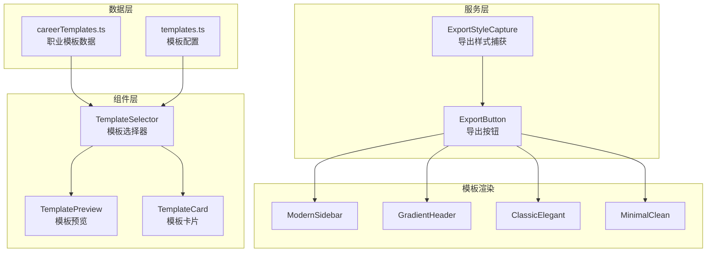
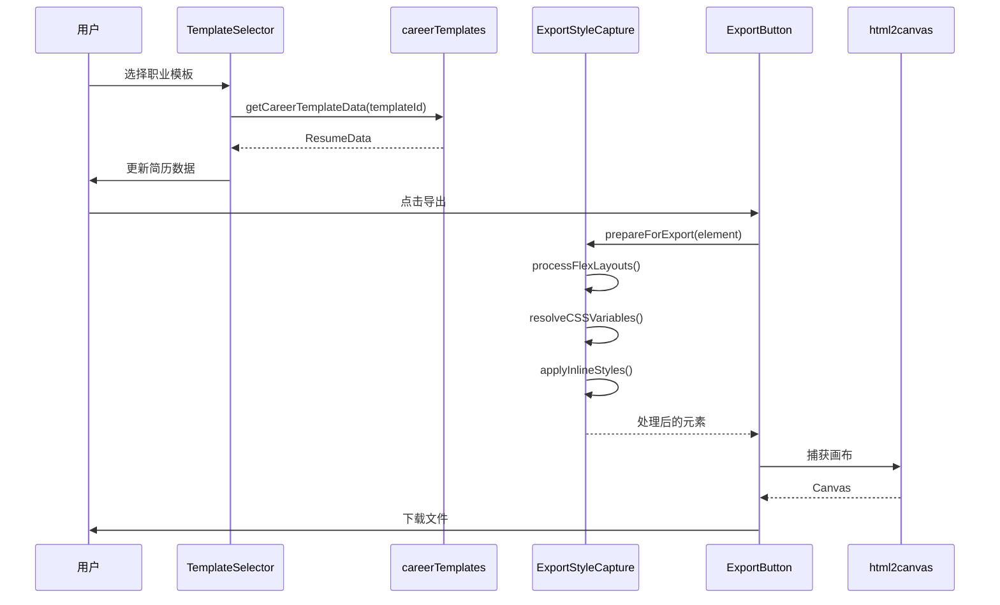

# 设计文档

## 概述

本设计文档描述了简历编辑器模板选择器重构和导出样式修复的技术实现方案。主要包括：
1. 将职业模板数据提取到独立文件
2. 重构 TemplateSelector 组件结构
3. 增强 exportStyleCapture 服务以正确处理 flex 布局
4. 优化 TemplatePreview 组件

## 架构

### 整体架构图



### 数据流



## 组件和接口

### 1. 职业模板数据模块 (src/data/careerTemplates.ts)

```typescript
/**
 * 职业模板数据文件
 * 包含所有预设职业模板的简历数据
 */

import { ResumeData } from '@/types/resume'

/**
 * 职业模板 ID 类型
 */
export type CareerTemplateId = 
  | 'career-ui-designer'
  | 'career-frontend-developer'
  | 'career-backend-developer'
  | 'career-operations'
  | 'career-product-manager'

/**
 * 职业模板数据映射
 */
export const careerTemplateDataMap: Record<CareerTemplateId, ResumeData> = {
  'career-ui-designer': { /* UI设计师数据 */ },
  'career-frontend-developer': { /* 前端开发数据 */ },
  'career-backend-developer': { /* 后端开发数据 */ },
  'career-operations': { /* 运营专员数据 */ },
  'career-product-manager': { /* 产品经理数据 */ }
}

/**
 * 获取职业模板数据
 * @param templateId - 模板ID
 * @returns 对应的简历数据，如果不存在返回 null
 */
export function getCareerTemplateData(templateId: string): ResumeData | null {
  if (templateId in careerTemplateDataMap) {
    return careerTemplateDataMap[templateId as CareerTemplateId]
  }
  return null
}

/**
 * 检查是否为职业模板
 * @param templateId - 模板ID
 * @returns 是否为职业模板
 */
export function isCareerTemplate(templateId: string): boolean {
  return templateId in careerTemplateDataMap
}
```

### 2. 重构后的 TemplateSelector 组件

```typescript
/**
 * TemplateSelector 组件接口
 */
interface TemplateSelectorProps {
  isOpen: boolean
  onClose: () => void
  onSelectTemplate: (template: TemplateStyle) => void
  onUpdateResumeData?: (data: ResumeData) => void
  currentTemplate?: string
}

/**
 * 组件职责划分：
 * - TemplateSelector: 主容器，管理状态和布局
 * - 分类导航: 左侧分类列表（内联实现，约50行）
 * - 模板网格: 使用 TemplateCard 组件
 * - 预览弹窗: 使用 TemplatePreview 组件
 */
```

### 3. Flex 布局处理接口 (ExportStyleCapture 扩展)

```typescript
/**
 * Flex 布局处理配置
 */
export interface FlexLayoutConfig {
  /** 容器宽度（像素） */
  containerWidth: number
  /** 是否递归处理嵌套容器 */
  recursive: boolean
  /** A4 页面宽度 */
  pageWidth: number
}

/**
 * Flex 子元素信息
 */
export interface FlexChildInfo {
  /** 元素 */
  element: HTMLElement
  /** 原始宽度样式 */
  originalWidth: string
  /** 计算后的像素宽度 */
  computedWidth: number
  /** flex-basis 值 */
  flexBasis: string
  /** flex-grow 值 */
  flexGrow: number
  /** flex-shrink 值 */
  flexShrink: number
}

/**
 * ExportStyleCapture 类扩展方法
 */
export class ExportStyleCapture {
  /**
   * 处理 Flex 布局，将百分比宽度转换为固定像素值
   * @param element - 要处理的元素
   * @param config - 配置选项
   */
  processFlexLayouts(element: HTMLElement, config?: Partial<FlexLayoutConfig>): void

  /**
   * 检测元素是否为 Flex 容器
   * @param element - 要检测的元素
   * @returns 是否为 Flex 容器
   */
  isFlexContainer(element: HTMLElement): boolean

  /**
   * 获取 Flex 子元素信息
   * @param container - Flex 容器
   * @returns 子元素信息数组
   */
  getFlexChildrenInfo(container: HTMLElement): FlexChildInfo[]

  /**
   * 应用固定宽度到 Flex 子元素
   * @param children - 子元素信息数组
   * @param containerWidth - 容器宽度
   */
  applyFixedWidths(children: FlexChildInfo[], containerWidth: number): void
}
```

### 4. 导出预处理流程

```typescript
/**
 * 导出预处理结果
 */
export interface ExportPreparationResult {
  /** 处理后的元素克隆 */
  element: HTMLElement
  /** 是否成功 */
  success: boolean
  /** 警告信息 */
  warnings: string[]
  /** 处理的 Flex 容器数量 */
  flexContainersProcessed: number
  /** 解析的 CSS 变量数量 */
  cssVariablesResolved: number
}

/**
 * 完整的导出预处理方法
 * @param sourceElement - 源预览元素
 * @returns 预处理结果
 */
export async function prepareForExport(
  sourceElement: HTMLElement
): Promise<ExportPreparationResult>
```

## 数据模型

### 职业模板数据结构

```typescript
/**
 * 职业模板基础结构
 * 继承自 ResumeData，所有字段都是必填的
 */
interface CareerTemplateData extends ResumeData {
  personalInfo: {
    name: string
    title: string
    email: string
    phone: string
    location: string
    website?: string
    summary: string
    avatar?: string
  }
  experience: Array<{
    id: string
    company: string
    position: string
    startDate: string
    endDate: string
    current: boolean
    description: string[]
    location?: string
  }>
  education: Array<{
    id: string
    school: string
    degree: string
    major: string
    startDate: string
    endDate: string
    gpa?: string
    description?: string
  }>
  skills: Array<{
    id: string
    name: string
    level: number
    category?: string
  }>
  projects: Array<{
    id: string
    name: string
    description: string
    technologies: string[]
    startDate?: string
    endDate?: string
    url?: string
    highlights?: string[]
  }>
}
```

### Flex 布局处理常量

```typescript
/**
 * A4 页面尺寸常量
 */
export const A4_DIMENSIONS = {
  /** 宽度（像素，96dpi） */
  WIDTH_PX: 794,
  /** 高度（像素，96dpi） */
  HEIGHT_PX: 1123,
  /** 宽度（毫米） */
  WIDTH_MM: 210,
  /** 高度（毫米） */
  HEIGHT_MM: 297
} as const

/**
 * 默认侧边栏配置
 */
export const DEFAULT_SIDEBAR_CONFIG = {
  /** 默认侧边栏宽度百分比 */
  WIDTH_PERCENT: 32,
  /** 计算后的像素宽度 */
  WIDTH_PX: Math.round(794 * 0.32), // 254px
  /** 主内容区像素宽度 */
  MAIN_WIDTH_PX: Math.round(794 * 0.68) // 540px
} as const
```


## 正确性属性

*正确性属性是一种特征或行为，应该在系统的所有有效执行中保持为真——本质上是关于系统应该做什么的形式化陈述。属性作为人类可读规范和机器可验证正确性保证之间的桥梁。*

### Property 1: 职业模板数据获取一致性

*对于任意* 有效的职业模板 ID（career-ui-designer、career-frontend-developer、career-backend-developer、career-operations、career-product-manager），调用 `getCareerTemplateData(templateId)` 应返回一个包含完整 personalInfo、experience、education、skills 和 projects 字段的有效 ResumeData 对象。

**验证: 需求 1.3**

### Property 2: 百分比宽度转像素计算正确性

*对于任意* 百分比宽度值 p（0 < p <= 100）和容器宽度 w（w > 0），`convertPercentToPixels(p, w)` 应返回 `Math.round(w * p / 100)`，且结果应为正整数。

**验证: 需求 3.2, 6.3, 6.5**

### Property 3: Flex 容器检测准确性

*对于任意* HTML 元素，`isFlexContainer(element)` 应返回 true 当且仅当该元素的计算样式 display 属性为 'flex' 或 'inline-flex'。

**验证: 需求 6.1**

### Property 4: Flex 子元素宽度应用完整性

*对于任意* Flex 容器及其子元素，调用 `processFlexLayouts(container)` 后，所有直接子元素应具有以像素为单位的内联 width 样式，且不包含百分比值。

**验证: 需求 3.4, 6.1, 6.2**

### Property 5: CSS 变量解析完整性

*对于任意* 包含 CSS 变量的元素，调用 `resolveCSSVariables(element)` 后，该元素及其所有子元素的内联样式中不应包含未解析的 `var()` 表达式。

**验证: 需求 3.5**

### Property 6: 嵌套 Flex 容器递归处理

*对于任意* 包含嵌套 Flex 容器的元素树，调用 `processFlexLayouts(root, { recursive: true })` 后，所有层级的 Flex 容器的子元素都应具有固定像素宽度。

**验证: 需求 6.4**

### Property 7: 布局类型支持完整性

*对于任意* 支持的布局类型（sidebar、gradient、classic、minimal、creative、default），`getLayoutType(template)` 应返回正确的布局类型字符串，且 `renderLayout()` 应能成功渲染该类型。

**验证: 需求 5.4**

### Property 8: Flex 属性保留完整性

*对于任意* 具有 flex-basis、flex-grow 或 flex-shrink 属性的 Flex 子元素，调用 `processFlexLayouts()` 后，这些属性的计算值应被正确转换为等效的固定宽度。

**验证: 需求 4.4**

## 错误处理

### 职业模板数据获取错误

```typescript
/**
 * 当请求不存在的职业模板时
 */
function getCareerTemplateData(templateId: string): ResumeData | null {
  if (!(templateId in careerTemplateDataMap)) {
    console.warn(`Career template not found: ${templateId}`)
    return null
  }
  return careerTemplateDataMap[templateId as CareerTemplateId]
}
```

### 导出预处理错误

```typescript
/**
 * 导出预处理可能的错误情况
 */
interface ExportError {
  /** 错误类型 */
  type: 'ELEMENT_NOT_FOUND' | 'CLONE_FAILED' | 'STYLE_CAPTURE_FAILED' | 'FLEX_PROCESSING_FAILED'
  /** 错误消息 */
  message: string
  /** 原始错误 */
  originalError?: Error
}

/**
 * 错误处理策略
 * 1. ELEMENT_NOT_FOUND: 抛出错误，阻止导出
 * 2. CLONE_FAILED: 尝试使用原始元素，记录警告
 * 3. STYLE_CAPTURE_FAILED: 继续导出，记录警告
 * 4. FLEX_PROCESSING_FAILED: 继续导出，使用原始布局
 */
```

### Flex 布局处理边界情况

```typescript
/**
 * 边界情况处理
 */
const handleEdgeCases = {
  // 空容器
  emptyContainer: (container: HTMLElement) => {
    if (container.children.length === 0) {
      return // 跳过处理
    }
  },
  
  // 零宽度容器
  zeroWidthContainer: (container: HTMLElement) => {
    const width = container.getBoundingClientRect().width
    if (width === 0) {
      // 使用 A4 默认宽度
      return A4_DIMENSIONS.WIDTH_PX
    }
    return width
  },
  
  // 无效百分比值
  invalidPercentage: (value: string) => {
    const parsed = parseFloat(value)
    if (isNaN(parsed) || parsed < 0 || parsed > 100) {
      console.warn(`Invalid percentage value: ${value}`)
      return null
    }
    return parsed
  }
}
```

## 测试策略

### 双重测试方法

本项目采用单元测试和属性测试相结合的方式：

- **单元测试**: 验证特定示例、边界情况和错误条件
- **属性测试**: 验证跨所有输入的通用属性

### 属性测试配置

- **测试库**: fast-check (TypeScript 属性测试库)
- **最小迭代次数**: 每个属性测试 100 次
- **标签格式**: `Feature: template-export-optimization, Property N: 属性描述`

### 测试文件结构

```
src/
├── data/__tests__/
│   └── careerTemplates.property.test.ts  # Property 1
├── services/__tests__/
│   └── exportStyleCapture.property.test.ts  # Property 2-6, 8
└── components/__tests__/
    └── TemplatePreview.property.test.ts  # Property 7
```

### 单元测试覆盖

1. **careerTemplates.ts**
   - 测试所有 5 个职业模板数据的完整性
   - 测试无效 templateId 返回 null
   - 测试 isCareerTemplate 函数

2. **exportStyleCapture.ts**
   - 测试 Flex 容器检测
   - 测试百分比转像素计算
   - 测试 CSS 变量解析
   - 测试嵌套 Flex 处理

3. **TemplateSelector.tsx**
   - 测试组件渲染
   - 测试模板选择回调
   - 测试分类筛选

4. **TemplatePreview.tsx**
   - 测试所有布局类型渲染
   - 测试 memoization 效果

### 属性测试示例

```typescript
// Property 2: 百分比宽度转像素计算正确性
describe('Feature: template-export-optimization, Property 2: 百分比宽度转像素计算正确性', () => {
  it('should correctly convert percentage to pixels for all valid inputs', () => {
    fc.assert(
      fc.property(
        fc.float({ min: 0.01, max: 100 }),  // 百分比
        fc.float({ min: 1, max: 2000 }),     // 容器宽度
        (percentage, containerWidth) => {
          const result = convertPercentToPixels(percentage, containerWidth)
          const expected = Math.round(containerWidth * percentage / 100)
          return result === expected && result > 0
        }
      ),
      { numRuns: 100 }
    )
  })
})
```
